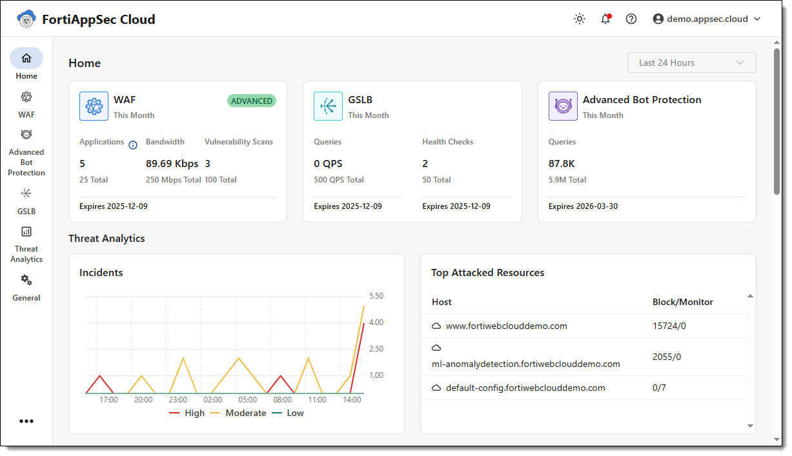

In this first lab, you will explore the FortiAppSec Cloud interface, understand how licenses work, and become familiar with the key concepts of Web Application Firewall (WAF) configuration.

---

??? note "1. Accessing the FortiAppSec Cloud Interface"
    To access the FortiAppSec Cloud portal, go to <a href="https://appsec.fortinet.com" target="_blank">https://appsec.fortinet.com</a>.

    - Click the **Login** button in the top right corner.
    - Sign in using your **FortiCloud credentials** (email and password).
    - Once logged in, you will be redirected to your personal FortiAppSec Cloud environment.

    If you don’t have an active contract or just want to explore, click on **Explore the Demo Center**  
    to access a **read-only demo environment** with pre-configured applications and traffic.

    

??? note "2. The Home page"
    After logging in, the **Home** page provides a summary of all services:

    - **Threat Analytics**: Displays attack trends and severity. Highlights your most targeted applications.
    - **WAF**: Shows traffic throughput, incoming requests, and server status.
    - **GSLB**: Displays metrics for DNS queries per second, FQDN status, and health check usage.
    - **Advanced Bot Protection (ABP)**: Lists top applications by attack query, with stats on blocked vs detected bot traffic.

    Use the time selector at the top to filter insights over specific hours, days, or custom date ranges.

    

??? note "3. Where to Get FortiAppSec Cloud Contracts"
    FortiAppSec Cloud contracts are available from three main sources:

    - **Fortinet Sales**: Full feature set, including WAF, GSLB, Advanced Bot Protection, and SOCaaS.
    - **FortiFlex**: A pay-as-you-go model based on points, flexible and scalable.
    - **Cloud Marketplaces**: Subscriptions via AWS, Azure, or GCP. Billing is usage-based.

    Only one contract type can be active at a time per FortiCloud account. Be sure to register all licenses under the same FortiCloud account to avoid conflicts.

??? note "4. Standard, Advanced, and Enterprise Plans"
    FortiAppSec Cloud offers three licensing tiers:

    - **Standard**: Core protections (signatures, request limits, basic bot defense).
    - **Advanced**: Adds machine learning, API protection, and threat analytics.
    - **Enterprise**: Includes all features, plus ABP, GSLB, and SOCaaS.

    | Feature Category                  | Standard | Advanced | Enterprise |
    |----------------------------------|:--------:|:--------:|:----------: |
    | **Web Application Protection**   |          |          |             |
    | Signature based Protection       | ✅       | ✅       | ✅         |
    | IP Threat Intelligence           | ✅       | ✅       | ✅         |
    | GEO-IP Intelligence              | ✅       | ✅       | ✅         |
    | Custom Security Rules            | ✅       | ✅       | ✅         |
    | HTTP Compliance                  | ✅       | ✅       | ✅         |
    | URL, Parameter, CORS Protection  | ✅       | ✅       | ✅         |
    | Cookie Protection                | ✅       | ✅       | ✅         |
    | Information Leakage              | ✅       | ✅       | ✅         |
    | AV for File Uploads              | ✅       | ✅       | ✅         |
    | Sandboxing for File Uploads      | ❌       | ✅       | ✅         |
    | Zero Day ML Anomaly Detection    | ❌       | ✅       | ✅         |
    |                                  |          |          |            |
    | **API Security**                 |          |          |             |
    | Schema Enforcement               | ✅       | ✅       | ✅         |
    | API Gateway                      | ❌       | ✅       | ✅         |
    | Mobile API Protection            | ❌       | ✅       | ✅         |
    | ML API Discovery & Protection    | ❌       | ✅       | ✅         |
    |                                  |          |          |            |
    | **Client Security**              |          |          |             |
    | HTTP Header Protection           | ✅       | ✅       | ✅         |
    | CSRF and MiTB Protection         | ✅       | ✅       | ✅         |
    |                                  |          |          |            |
    | **Bot Defense**                  |          |          |             |
    | Signature, Threshold, Deception  | ✅       | ✅       | ✅         |
    | ML-based Bot Defense             | ❌       | ✅       | ✅         |
    | Advanced Bot Protection (ABP)    | ❌       | ❌       | ✅         |
    |                                  |          |          |            |
    | **Account Takeover Protection**  |          |          |             |
    | User Tracking                    | ❌       | ✅       | ✅         |
    | Session Fixation Protection      | ❌       | ✅       | ✅         |
    | Credential Stuffing Defense      | ❌       | ✅       | ✅         |
    |                                  |          |          |            |
    | **DDoS Protection**              |          |          |             |
    | Layer 3-4 DDoS Mitigation        | ✅       | ✅       | ✅         |
    | Layer 7 DDoS Mitigation          | ✅       | ✅       | ✅         |
    |                                  |          |          |            |
    | **Application Delivery**         |          |          |             |
    | SSL Certificates (Automatic & Custom)   | ✅       | ✅       | ✅         |
    | Client Authentication/Mutual TLS   | ❌       | ✅       | ✅         |
    | Content Delivery Network (CDN)     | ✅       | ✅       | ✅         |
    | Limited Geo CDN                    | ✅       | ✅       | ✅         |
    | Load Balancing & Health Monitor  | ✅       | ✅       | ✅         |
    | Origin Server Content Routing    | ❌       | ✅       | ✅         |
    | Waiting Room                     | ❌       | ✅       | ✅         |
    |                                  |          |          |            |
    | **Global Server Load Balancing** |          |          |             |
    | DNS Load Balancing               | Add-on       | Add-on       | ✅         |
    | DNS Services + DNSSEC            | Add-on       | Add-on       | ✅         |
    | Synthetic Health Checks          | Add-on       | Add-on       | ✅         |
    |                                  |          |          |            |
    | **Reporting & Analytics**        |          |          |             |
    | Attack Logs & Alerting           | ✅       | ✅       | ✅         |
    | SIEM Integration                 | ✅       | ✅       | ✅         |
    | Log Sensitive Data Masking                      | ✅       | ✅       | ✅         |
    | FortiView, Dashboards & Reports      | ✅       | ✅       | ✅         |
    | Traffic Logs Export (Cloud native storage integration)                 | ❌       | ✅       | ✅         |
    | Threat Analytics AI              | ❌       | ✅       | ✅         |
    |                                  |          |          |            |
    | **Management**                   |          |          |             |
    | Role-Based Access Control        | ✅       | ✅       | ✅         |
    | Single Sign-On (SSO)             | ✅       | ✅       | ✅         |
    | API Support                      | ✅       | ✅       | ✅         |
    |                                  |          |          |            |
    | **Services**                     |          |          |             |
    | 24x7 Support                     | ✅       | ✅       | ✅         |
    | SOCaaS                           | Add-on       | Add-on       | ✅         |

??? note "5. Viewing Your Contract"
    To check your current license:

    1. Go to **General > Contracts**.
    2. This page shows your contract type, status, application count, bandwidth, and expiration date.

    From this view, you can also **activate a new contract**.

    

??? note "6. Bandwidth Calculation"
    FortiAppSec Cloud calculates **WAF bandwidth usage** using a 95th percentile model:

    - Bandwidth is measured in 5-minute intervals.
    - The top 5% of those intervals (the highest peaks) are discarded.
    - The **highest value among the remaining intervals** is used as your billable bandwidth.

    This model prevents short traffic spikes from inflating your monthly bill.

    At the beginning of the month, the usage may show **"0 Mbps"** until enough 5-minute intervals are recorded.

    To view your WAF usage, go to **General > Usage** in the left-hand menu.

    The **Usage** page provides a clear summary of how your account is being used, broken down by month. It helps you:

    - Track your consumption trends.
    - Detect overages before they become an issue.
    - Understand resource utilization across services.

    The **Account Usage graph** displays up to 12 months of bandwidth history. Hover over any bar to see the exact usage for that month.

    

??? note "7. WAF Key Concepts"
    Understanding the key WAF components is essential prior to onboarding an application:

    - **Application**: A logical unit representing a web application (typically a domain or subdomain). It serves as the basis for both configuration and billing.
    
    - **Endpoint**: The public-facing entry point that receives client traffic. It defines the frontend configuration, including domain name, CNAME, HTTP/HTTPS ports, SSL certificate, TLS version, cipher suite, and client certificate authentication (if applicable).
    
    - **Origin Server**: The backend infrastructure that hosts the actual content. This defines the server pool, load balancing algorithm, session persistence, health checks, and backend SSL/TLS parameters.
    
    - **Content Route**: When multiple origin servers are associated with a single endpoint, content routing rules determine how traffic is directed based on path, header, cookie, query parameter, or source IP.
    
    - **Scrubbing Center**: A Fortinet-managed WAF gateway that inspects and filters traffic before forwarding it to the origin server. It acts as the first line of defense against malicious requests.
    
    - **CDN (Content Delivery Network)**: When enabled, static content is cached within FortiAppSec Cloud's distributed scrubbing centers. Requests are served from the closest center, reducing latency and improving performance.  
      For more information, refer to the documentation on **Restricting Direct Traffic** and **Allowing FortiAppSec Cloud IP Addresses**.

    These components collectively ensure that traffic is inspected, routed, and protected efficiently, with minimal latency and maximum security.

Ready for the next step? In the following lab, you’ll onboard a real web application (DVWA) and apply WAF protections.
