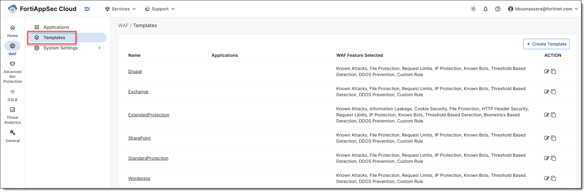

In this lab, you will onboard your own test application (e.g., `dvwa1.labsec.ca`) to FortiAppSec Cloud's Web Application Firewall. This process activates core WAF protection features and prepares traffic filtering through Fortinet's scrubbing centers.

### Step 1: Define Your Application Domain

Select your application hostname from the list below.
It will be used throughout the lab to personalize DNS configuration and testing steps.

<form id="userAppForm" style="border: 1px solid #ccc; padding: 15px; margin: 15px auto; max-width: 400px;">
    <div style="display: flex; flex-direction: column; gap: 10px;">
        <label for="appName" style="font-weight: bold;">Application Domain Name:</label>
        <select id="appName" name="appName" required style="border: 1px solid #ccc; padding: 5px;">
            <option value="">-- Select your application --</option>
            <option value="dvwa1.labsec.ca">dvwa1.labsec.ca</option>
            <option value="dvwa2.labsec.ca">dvwa2.labsec.ca</option>
            <option value="dvwa3.labsec.ca">dvwa3.labsec.ca</option>
            <option value="dvwa4.labsec.ca">dvwa4.labsec.ca</option>
            <option value="dvwa5.labsec.ca">dvwa5.labsec.ca</option>
        </select>
        <p id="appNameDisplay" style="margin: 0;">
            This will be your hostname used throughout the lab: <strong style="color: green;">@APP_NAME</strong>.
        </p>
    </div>
</form>


### Step 2: Application Onboarding Process

??? note "1. Prepare Access and IP Filtering"
    - Ensure the following **FortiAppSec Cloud IP addresses** are allowed on the origin server firewall or Public Cloud ACLs:
        - `3.123.68.65`
        - `3.226.2.163`
    
    - This step is mandatory to allow the scrubbing centers to reach your application.

    This step has already been completed for you in the Azure Portal:

    


??? note "2. Log in and open WAF Templates"
    - Go to [https://appsec.fortinet.com](https://appsec.fortinet.com){ target="_blank" }.

    - Use your FortiCloud credentials to log in.

    - Navigate to **WAF > Templates**.

    


??? note "3. Clone the StandardProtection template"
    - Locate the row for **StandardProtection**.

    - Click the Clone icon to create a copy.

    - Enter a name for your new template:
        ```plaintext
        StandardProtection-Clone
        ```

    - Click OK to save.

    This cloned template will be used later during onboarding.
    
    

??? note "4. Start application onboarding - Web Application Configuration"
    - Navigate to **WAF > Applications**.

    - Click Add Application to launch the onboarding wizard.

    - Enter an application name such as:

        ```plaintext
        DVWA-Lab
        ```

    - For domain name, use your assigned domain:

        ```plaintext
        @APP_NAME
        ```


    ??? warning "Wildcard domain rules"
        - Wildcard is **supported** except the first entry in the list.
        - Avoid overlapping entries: do **not** combine `"www.example.com"` and `"*.example.com"`.
        - Wildcards only match **one domain level**:  
        `"a.example.com"` matches `"*.example.com"` ✅  
        `"a.a.example.com"` does **not** ❌

    - Click `Next`.

    


??? note "5. Network Settings"
    - **Keep the default ports**: HTTP **80** and HTTPS **443**.
    - **Keep the default origin IP or FQDN** detected by FortiAppSec.
    - Click **Test Origin Server** to verify that FortiAppSec can reach the backend.
    - Click `Next`.

    These settings define how the **WAF communicates with the origin server** (your backend).
    You can adjust them later if needed in **WAF > Applications > DVWA-Lab > Network > Origin Servers**.

    

??? note "6. Define CDN and Application Location"
    - Leave **CDN** disabled (not required for this lab).
    - Select **Cloud Platform**: choose **AWS**.
    - Choose the **Scrubbing Center** closest to the backend: **Canada Central**.
    - Click `Next`.

    In this lab, the origin server is hosted in **Azure Canada East** (Québec City).

    The nearest FortiAppSec scrubbing centers are:

    - **AWS Canada Central** (Montréal)
    - **Azure Canada Central** (Toronto)

    

??? note "7. Configure Blocking Mode and Template"
    - Enable **Block Mode** to immediately activate WAF protection during the lab.  
      In a real environment, this setting is typically **disabled at first** to allow passive monitoring and fine-tuning before enforcing blocking.
    - Apply the **preconfigured web protection template** created earlier: `StandardProtection-Clone`.
    - Click `Save`.

    

??? note "8. Configure DNS (CNAME)"
    - Ask your instructor to update the **DNS records** for your application domain.
    - The DNS **CNAME** must point to the value generated by **FortiAppSec** during onboarding.
    - Without this update, traffic will not be routed through the WAF, and protection will not be active.
    - Click `Close`.

    
    
    

??? note "9. Validate connection and server certificate"
    - Open your application <a href="https://@APP_NAME" target="_blank">https://@APP_NAME</a>
    - You should observe the following:
        1. You are **redirected to FortiAppSec**.
        2. Your connection is now **encrypted (HTTPS)**, even though the application originally used HTTP (port 80).
        3. The certificate shown is currently a **default FortiAppSec certificate**.

    **🔓 Continue despite certificate warning:**

    - Click **"Advanced"**, then **"Proceed to @APP_NAME (unsafe)"**.
    - This is expected until a valid certificate is automatically issued.

    
    
    **🔍 View the certificate in Chrome:**

    - Click the **Not secure** icon in the address bar.
    - Click **Certificate details**.

    

??? note "10. Monitor Automatic Certificate"
    - Go to **WAF > Applications > DVWA-Lab > Network > Endpoints**.
    - Click the **ⓘ icon** under the **Actions** column to check the certificate status.
    - By default, FortiAppSec Cloud automatically retrieves SSL certificates from **Let's Encrypt**.
    - Once the HTTP Challenge is passed, the system:
        - Retrieves the certificate.
        - Installs it on your application.
        - Uses it for **HTTPS encryption**.
    - If the retrieval fails, FortiAppSec retries **every 12 minutes**.
    - You can force immediate retrieval by clicking the **Refresh** icon under **Actions**.
    - **Renewal process**:
        - Starts **30 days** before expiration.
        - FortiAppSec checks if the **DNS CNAME is still valid**.
        - If valid, the certificate is **automatically renewed for 90 days**.

    This ensures continuous HTTPS availability **without manual action**.

      
    

??? note "11. Restrict Direct Traffic & Allow FortiAppSec IPs"

    > ⚠️ This configuration is already set up for the lab — no action is required.  
    > However, in real-life deployments, this step is **critical** to ensure that no one can bypass the WAF and reach the origin server directly.

    - Once onboarding is complete, **restrict direct access** to the origin server.
    - Only allow traffic from **FortiAppSec Cloud IP addresses**.
    - If **CDN is enabled**, allow:
        - All **service management IPs**
        - All **scrubbing center IPs**
    - If **CDN is disabled**, allow:
        - The **assigned scrubbing center IPs**
        - The **service management IPs**
    - It is **recommended to allow all IPs** listed in FortiAppSec Cloud. This avoids configuration issues if CDN is enabled later.

    To retrieve the IP list:
    - Go to **WAF > Applications**
    - Click the **Allow IP List** button.
    - A pop-up will display all required IPs.
    - Optional: use **Add Filter** to filter by **Platform**, **Name**, or **Domain Name**.

    

    - FortiAppSec also provides dynamic IP feeds:
        - IPv4 feed: [https://appsec.fortinet.com/ips-v4](https://appsec.fortinet.com/ips-v4){target="_blank"}
        - IPv6 feed: [https://appsec.fortinet.com/ips-v6](https://appsec.fortinet.com/ips-v6){target="_blank"}

    These URLs can be imported into a **FortiGate as a Threat Feed** and used in security policies.

    

After onboarding, traffic will be routed through Fortinet scrubbing centers, analyzed in real-time, and forwarded to your origin only if deemed clean. Continue with the next Lab to explore protection modules and testing scenarios.
