To begin, we will connect to the DVWA Web Application through FortiAppSec Cloud.

??? note "Connecting to DVWA"
    ## Connecting to DVWA

    Connect to <a href="https://@APP_NAME" target="_blank">https://@APP_NAME</a>
    and authenticate with one of these accounts:

    | Username | Password |
    |:---------|:---------|
    | admin    | password |
    | gordonb  | abc123   |
    | 1337     | charley  |
    | pablo    | letmein  |
    | smithy   | password |

    ??? tip "Troubleshooting - If you encounter any authentication issues"

        - Browse to <a href="https://@APP_NAME/setup.php" target="_blank">https://@APP_NAME/setup.php</a>
    
        - Click on **Create / Reset Database**

        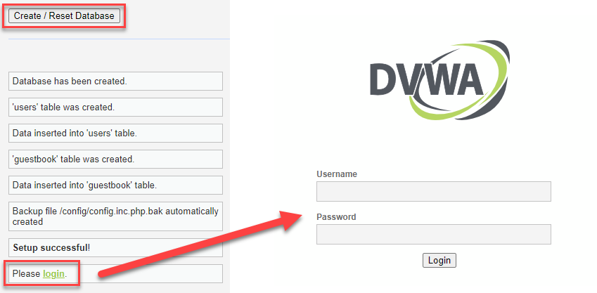

**FortiAppSec Cloud** allows you to enable **more than 35 protections** in every WAF profile.

The template **StandardProtection-Clone** is applied to the application, activating **around 15 protections** immediately.

The following modules are enabled — we will **review them in this lab**.

| Modules                       | Description                                                                                                                       |
| ----------------------------- | --------------------------------------------------------------------------------------------------------------------------------- |
| **Known Attacks**             | Protects against known attacks, including common vulnerabilities and exposures (CVEs) as well as OWASP Top 10 threats.            |
| **File Protection**           | Ensures all uploaded files are safe and meet size and type guidelines.                                                            |
| **Request Limits**            | Enforces HTTP request limits to ensure compliance with standards and prevent exploits like malicious encoding or buffer overflow. |
| **IP Protection**             | Restricts access by allowing or blocking requests from specific source IP addresses.                                              |
| **Known Bots**                | Blocks known malicious bots (e.g., those used for DDoS attacks, spamming, or aggressive crawling) while allowing legitimate bots. |
| **Threshold-Based Detection** | Uses threshold-based analysis to identify and block suspicious automated traffic (bad bots).                                      |
| **DDoS Prevention**           | Mitigates distributed denial-of-service attacks at both the network and application layers.                                       |
| **Custom Rule**               | Supports custom rules for advanced access control tailored to complex, application-specific conditions.                           |


??? note "Sequence of Scans"
    ##Sequence of Scans

    FortiAppSec Cloud applies protection rules and performs scans in the order of execution according to the following list.

    The second tab shows the ==key security features== that are enabled in the **StandardProtection** template.

    === "Protections"

        1. TCP Connection Number Limit (TCP Flood Prevention)  
        2. Add X-Forwarded-For  
        3. IP List  
        4. IP Reputation  
        5. Known Bots  
        6. Geo IP  
        7. WebSocket security  
        8. HTTP Allow Method  
        9. HTTP Request Limit (HTTP Flood Prevention)  
        10. TCP Connection Number Limit (Malicious IP)  
        11. HTTP Request Limit (HTTP Access Limit)  
        12. URL Access  
        13. Mobile API Protection  
        14. Request Limits  
        15. File Protection  
        16. Advanced Bot Protection  
        17. Parameter Validation  
        18. Bot Deception  
        19. ML Based Bot Detection  
        20. Cross-site request forgery (CSRF) attacks  
        21. Protection for Man-in-the-Browser (MITB) attacks  
        22. Biometrics Based Detection  
        23. XML Protection  
        24. JSON Protection  
        25. Signature Based Detection  
        26. SQL Syntax Based Detection  
        27. Custom Rule  
        28. Threshold Based Detection  
        29. Account Takeover  
        30. API Gateway  
        31. OpenAPI Validation  
        32. URL Rewriting (rewriting & redirection)  
        33. Machine Learning - Anomaly Detection  
        34. Compression  
        35. Cookie Security

    === "Highlights"

        1. ==TCP Connection Number Limit (TCP Flood Prevention)== 
        2. Add X-Forwarded-For
        3. ==IP List== 
        4. ==IP Reputation== 
        5. ==Known Bots==
        6. ==Geo IP==
        7. WebSocket security  
        8. ==HTTP Allow Method==
        9. ==HTTP Request Limit (HTTP Flood Prevention)==
        10. ==TCP Connection Number Limit (Malicious IP)== 
        11. ==HTTP Request Limit (HTTP Access Limit)==  
        12. URL Access
        13. Mobile API Protection  
        14. ==Request Limits==
        15. ==File Protection==
        16. Advanced Bot Protection  
        17. Parameter Validation
        18. Bot Deception
        19. ML Based Bot Detection
        20. Cross-site request forgery (CSRF) attacks
        21. Protection for Man-in-the-Browser (MITB) attacks
        22. Biometrics Based Detection  
        23. XML Protection  
        24. JSON Protection  
        25. ==Signature Based Detection==
        26. ==SQL Syntax Based Detection==
        27. ==Custom Rule==
        28. ==Threshold Based Detection==
        29. Account Takeover
        30. API Gateway  
        31. OpenAPI Validation  
        32. URL Rewriting (rewriting & redirection)
        33. Machine Learning - Anomaly Detection
        34. Compression  
        35. Cookie Security

??? note "Known Attacks"
    ### Description
    FortiAppSec Cloud uses up-to-date **signatures** to block OWASP Top 10 threats like **XSS**, **SQL Injection**, and **known exploits**. It analyzes traffic at the **packet level**, checks against its signature database, and applies **automated actions** to protect your applications.

    ### Configuration

    Go to:  
    `WAF > Templates > StandardProtection-Clone > Security Rules > Known Attacks`

    Here are the key settings available in this section:

    **1. Actions**  
    You can choose how FortiAppSec reacts to known attacks: **Alert** logs the request, **Alert & Deny** blocks and logs, and **Deny (No Log)** blocks silently.

    **2. Sensitivity Level (SL)**  
    SL controls detection strictness from **SL1 (least strict)** to **SL4 (most strict)**. Higher levels improve protection but may block legitimate requests.

    **3. Mode Per Protection**  
    Each rule can be set to **Standard**, **Extended**, or **Disabled**. Extended offers broader coverage but may cause false positives.

    **4. Exception Rules**  
    Exception Rules skip inspection for specific URLs or parameters to prevent blocking known false positives.

    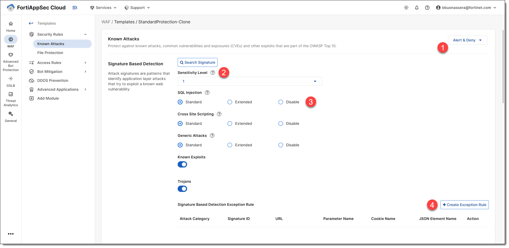

    ### Performing Command Injection

    Browse to <a href="https://@APP_NAME/vulnerabilities/exec/" target="_blank">https://@APP_NAME/vulnerabilities/exec/</a> and try one of these command injection attacks:

    ```
    ;ls -la
    ```
    ```
    ;more /etc/passwd
    ```

    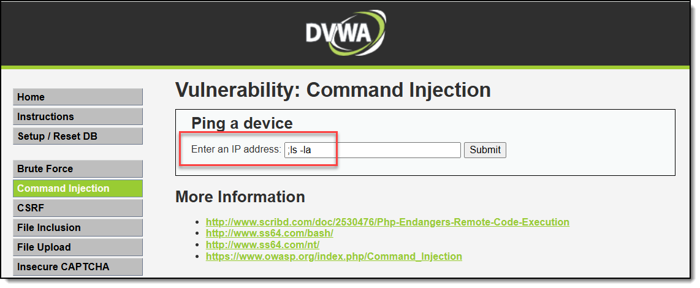

    Command injection will be **blocked**.

    

    Now try the following request:

    ```
    ;ps -aux
    ```

    This command is **not blocked** yet.

    Increase the sensitivity level to `3`.

    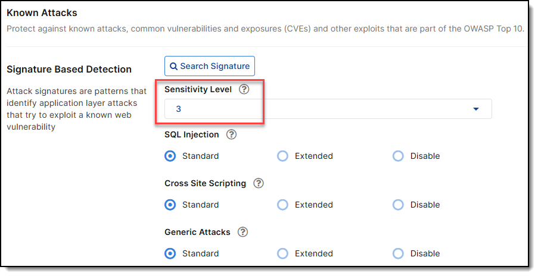

    ⚠️ Click `SAVE` to apply the changes.

    Try the same request again:

    ```
    ;ps -aux
    ```

    Now it **should be blocked**. Let's see **why**.

    ### Attack Logs

    Go to:  
    `WAF > Applications > DVWA-Lab > FortiView > Threats by Types`

    Select `Known Attacks`.  

    Select the **Source IP**.  

    Select the **Log Entry**.

    Look at the **details in the log entry**.

    You will see the **Signature ID** and the **Matched Pattern** that triggered the protection.

    This helps you understand why the request was blocked and which rule was applied.

    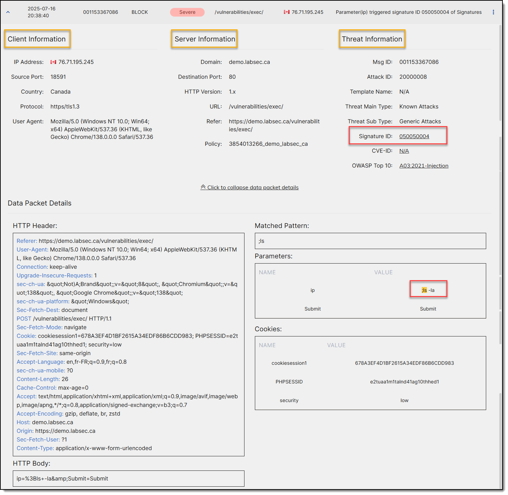

    Now check the log entry for the `ps -aux` command.

    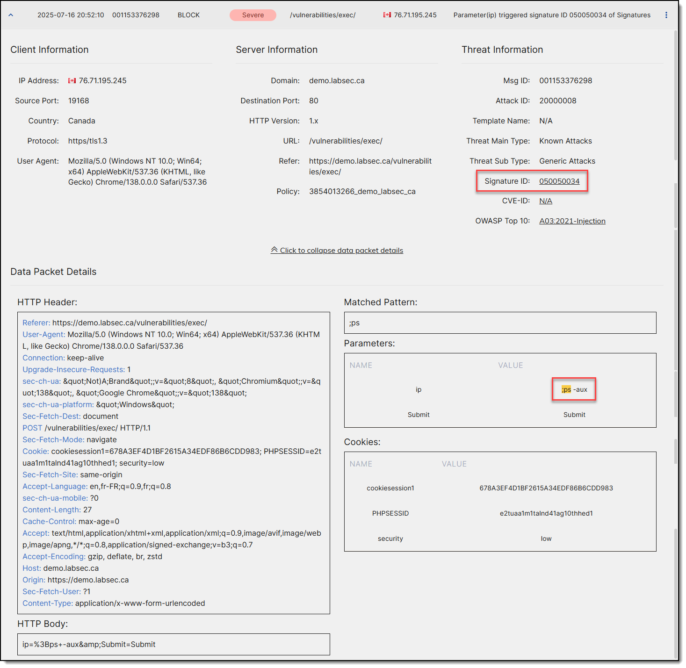

    Click on **Signature ID**.

    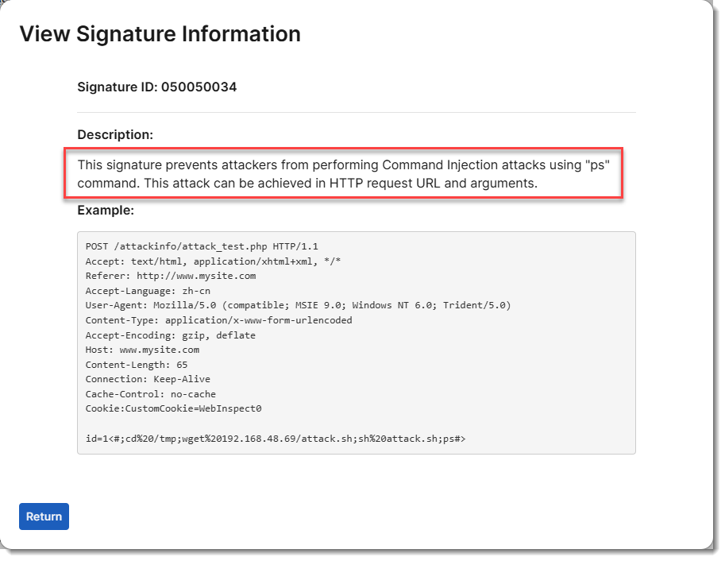

    Go to:  
    `WAF > Templates > StandardProtection-Clone > Security Rules > Known Attacks`

    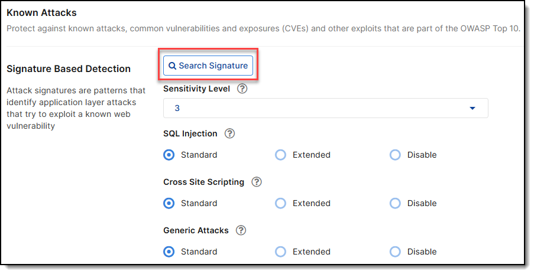

    Search for Signature ID:
    ```
    050050034
    ```

    This signature is set to sensitivity level **3**. That's why it was blocked the second time.

    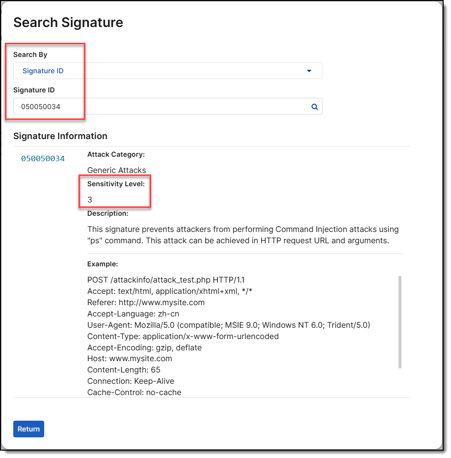

    You can also search for all signatures with sensitivity level 3.

    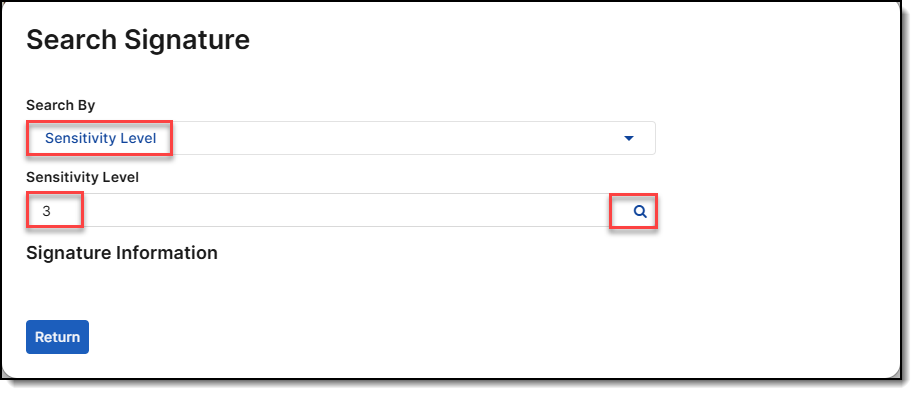

    ### Adding an Exception Rule

    Go to:  
    `WAF > Templates > StandardProtection-Clone > Security Rules > Known Attacks`

    Click `Create Exception Rule`

    Request URL:  
    ```
    /vulnerabilities/exec/
    ```
    Attack Category:
    ```
    Generic Attack
    ```
    Signature ID:  
    ```
    050050034
    ```

    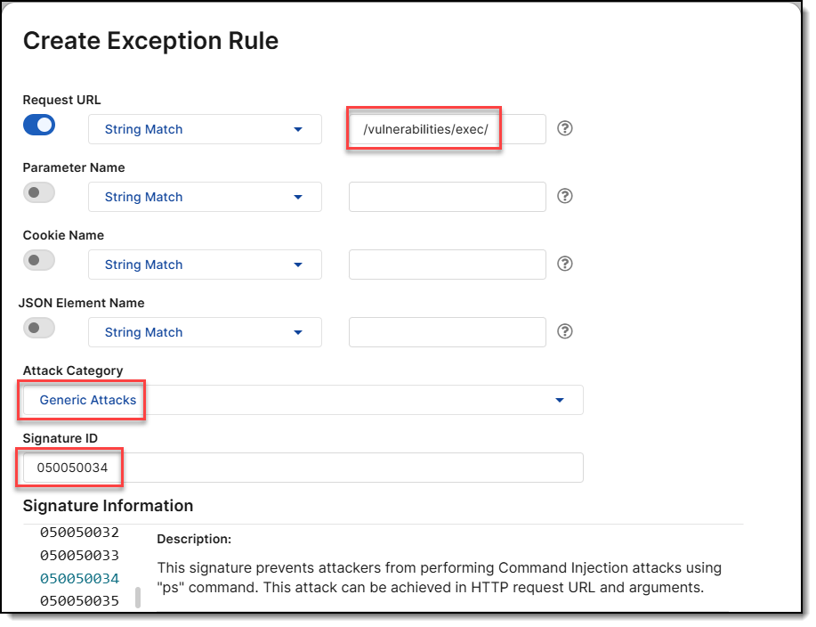

    Click `OK`

    ⚠️ Click `SAVE`
    
    Browse to <a href="https://@APP_NAME/vulnerabilities/exec/" target="_blank">https://@APP_NAME/vulnerabilities/exec/</a> and try this command injection:
    ```
    ;ps -aux
    ```
    The exception works (you may need to wait 1–2 minutes since the policy change does not apply immediately).

    Browse to <a href="https://@APP_NAME/vulnerabilities/sqli/" target="_blank">https://@APP_NAME/vulnerabilities/sqli/</a> and try the same command:
    ```
    ;ps -aux
    ```
    The exception **does not apply** to this URL. The signature is still enforced for the rest of the website.

    ### Signature Updates

    To check the latest signature updates, visit the **FortiGuard Labs** page:  
    [https://www.fortiguard.com/services/ws](https://www.fortiguard.com/services/ws){target="_blank"}

    For example, on **July 15**, **6 new signatures** were added to the database.

    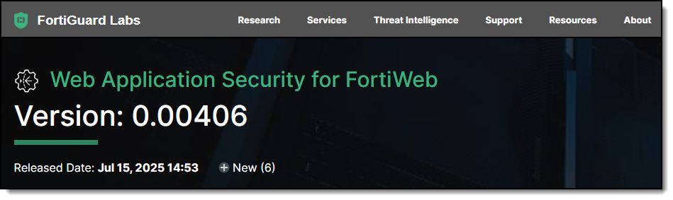


??? note "File Security"
    ### Description

    **File Protection** ensures that uploaded files are safe and comply with allowed file types and size limits.

    ### Configuration

    Go to:  
    `WAF > Templates > StandardProtection-Clone > Security Rules > File Protection`

    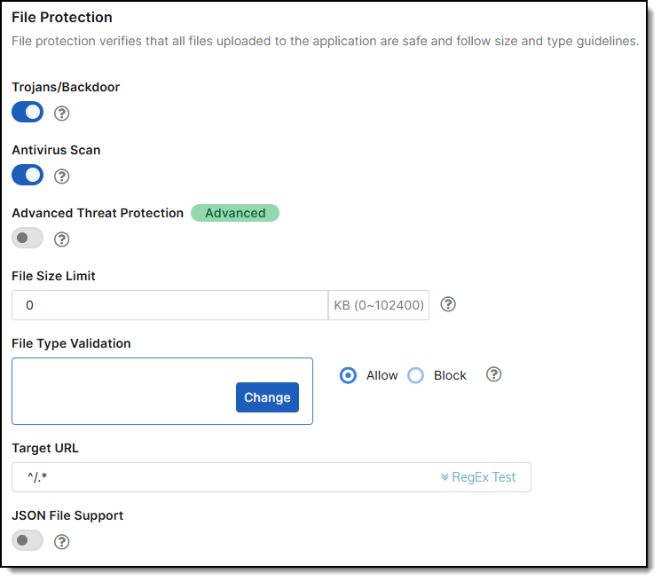

    ### Testing file security with EICAR

    Download <a href="https://secure.eicar.org/eicar_com.zip" target="_blank">https://secure.eicar.org/eicar_com.zip</a> on your computer.

    Browse to <a href="https://@APP_NAME/vulnerabilities/upload/" target="_blank">https://@APP_NAME/vulnerabilities/upload/</a> and upload **eicar_com.zip**.

    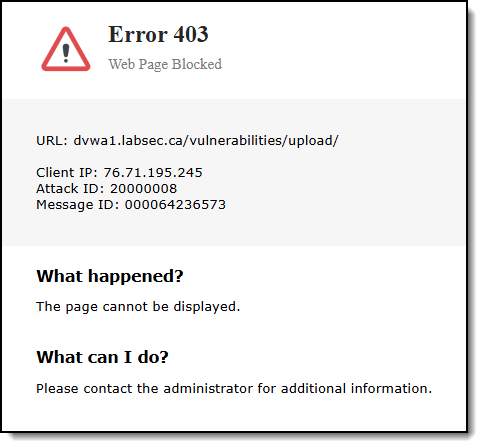

    If your current system blocks the EICAR file download, you can use the following Linux script to perform the test instead:

    - [Download the script](download/file_security.sh){target="_blank"}

    Before running the script, make sure to set the `DVWA_URL` and `DVWA_HOST` variables.  
    If you're unsure how to proceed, ask your instructor to run the test for you.

    ### Attack Logs

    Go to:  
    `WAF > Applications > DVWA-Lab > FortiView > Threats by Types`

    Select `File Protection`.  

    Select the **Source IP**.  

    Select the **Log Entry**.

    Look at the **details in the log entry**.

    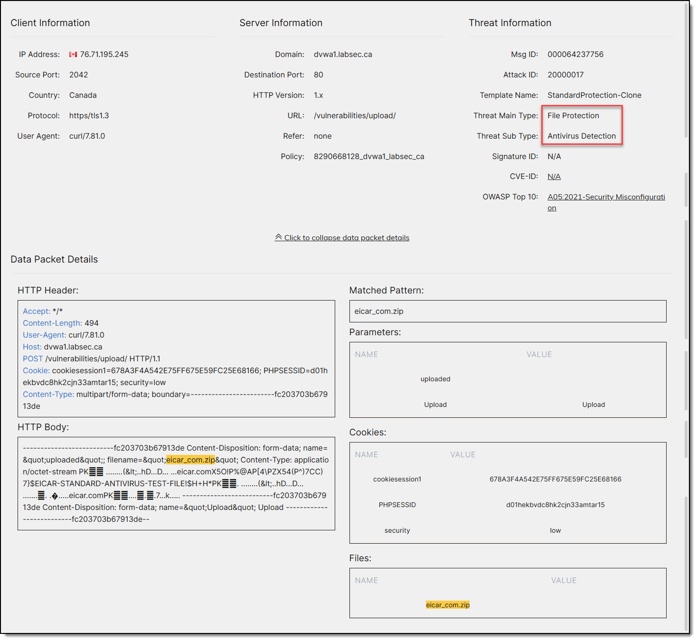

    ### 🧪 Web Shell Upload (Advanced Exercise)

    For this step, you'll receive **fewer instructions** — take your time and try to apply what you've learned.

    1. Download the following file:
    [https://raw.githubusercontent.com/mIcHyAmRaNe/wso-webshell/refs/heads/master/wso.php](https://raw.githubusercontent.com/mIcHyAmRaNe/wso-webshell/refs/heads/master/wso.php)

    2. Upload it to your lab application:  
    [https://@APP_NAME/vulnerabilities/upload/](https://@APP_NAME/vulnerabilities/upload/)

    3. Check the **logs** in FortiAppSec.

    4. The file is blocked — but **not by the antivirus**.  
    It's blocked by a **signature** in the Known Attacks section.  
    *(Remember the scan sequence!)*

    5. Identify the **signature** that blocked the upload.

    6. Add an **exception rule** to allow this signature on the URL:  
    `/vulnerabilities/upload/`

    7. Upload the file **again**.

    8. This time, the **signature is bypassed**, but the file is still blocked.

    9. Now it's the **Antivirus** feature that detects and blocks `wso.php`.

    ✅ Good job! You've learned how different layers of protection work together in FortiAppSec.


??? note "Request Limits"
    ### Description

    Request Limits enforce limitations at the HTTP protocol level to make sure all client requests adhere to the HTTP RFC standard and security best practice. By using Request Limits you can prevent exploits such as malicious encoding and buffer overflows that can lead to Denial of Service (DoS) and server takeover.

    ### HTTP Allow Method

    You can configure policies that allow only specific HTTP request methods. This can be useful for preventing attacks, such as those exploiting the HTTP method TRACE.

    Many web applications only require GET and POST. Disabling all unused methods reduces the potential attack surface area for attackers.

    ### Configuration

    Go to:  
    `WAF > Templates > StandardProtection-Clone > Access Rules > Request Limits`

    In the **HTTP Allow Method** section:  
    - **Select** only `GET` and `POST`  
    - **Deselect** all other methods (e.g., `PUT`, `DELETE`, `OPTIONS`, etc.)

    ⚠️ Click `SAVE`

    This ensures only safe and commonly used HTTP methods are allowed.

    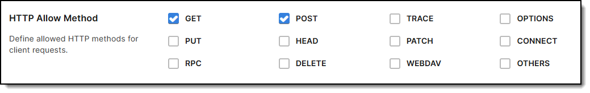

    ### Testing HTTP Allow Method

    Click the button below to send an HTTP request to `/login.php` using the HEAD method.
    
    [Send HEAD request](#){ .md-button onclick="sendHeadRequestToLogin()" }  

    <div id="http-method-result" style="margin-top: 1em; font-weight: bold;"></div>

    ### Attack logs

    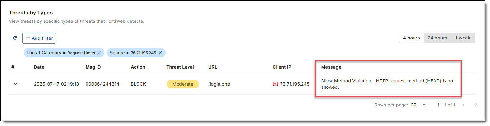

    ### HTTP Protocol Constraints

    Protocol constraints control HTTP elements like headers and body length to prevent attacks such as buffer overflows, which can occur when servers or applications fail to properly limit or handle malformed requests.

    ### Configuration

    Go to:  
    `WAF > Templates > StandardProtection-Clone > Access Rules > Request Limits`

    Under **HTTP Request Constraints** > **HTTP Parameter**, make sure the option **Duplicate Parameter Name** is **enabled**.

    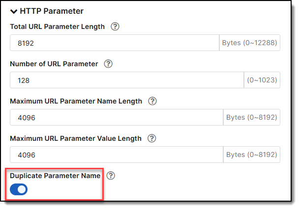

    ### Performing duplicate name attack

    Browse to <a href="https://@APP_NAME/vulnerabilities/brute/?username=admin&username=admin&password=password&Login=Login#" target="_blank">https://@APP_NAME/vulnerabilities/brute/?username=admin&username=admin&password=password&Login=Login#</a>

    ### Attack Logs

    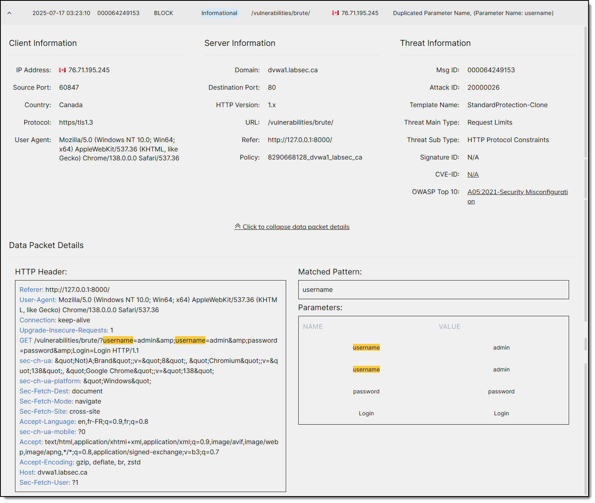


??? note "IP Protection"
    ### Description

    FortiAppSec’s IP Protection feature allows you to control access based on the client’s IP address, using reputation data, geolocation, or custom IP lists.
    
    ### Configuration

    Go to:  
    `WAF > Templates > StandardProtection-Clone > Access Rules > IP Protection`

    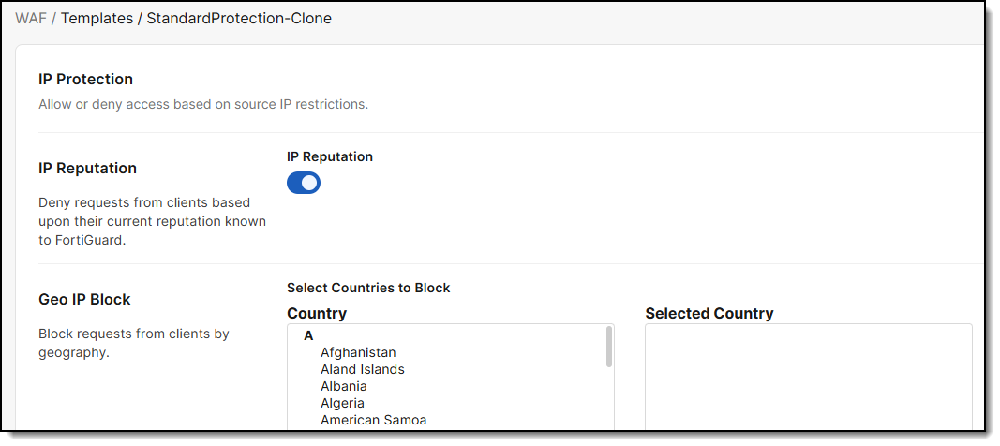

    ### Testing IP List

    Browse to <a href="https://ifconfig.me/" target="_blank">https://ifconfig.me/</a>.

    Copy your **public IP**.

    On `IP List` section add your public IP in the Block IP List.

    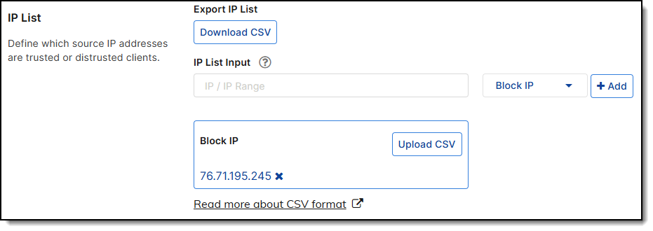

    ⚠️ Click `SAVE`

    Browse to <a href="https://@APP_NAME/login.php" target="_blank">https://@APP_NAME/login.php</a>.

    You should be **blocked**.

    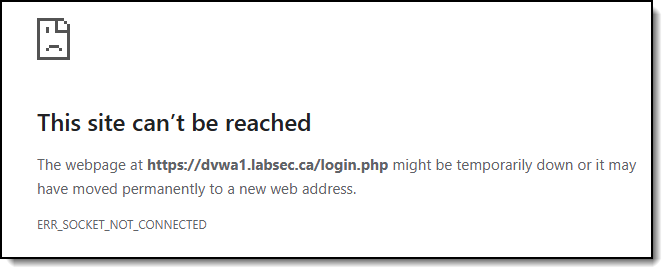

    ### Attack Logs

    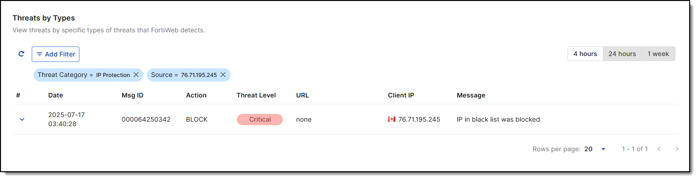

    !!! warning "Reminder"
        <center>**Remove your IP address from the protection list and SAVE before proceeding with the rest of the lab.**</center>

    ### GEO IP

    While numerous websites have a global reach, some are region-specific. For instance, government web applications often cater exclusively to their own residents.

    ### Configuration

    Go to:  
    `WAF > Templates > StandardProtection-Clone > Access Rules > IP Protection`

    Go to **Geo IP Block**, select **Canada** from the list, and add it to the **Selected Countries** to block.

    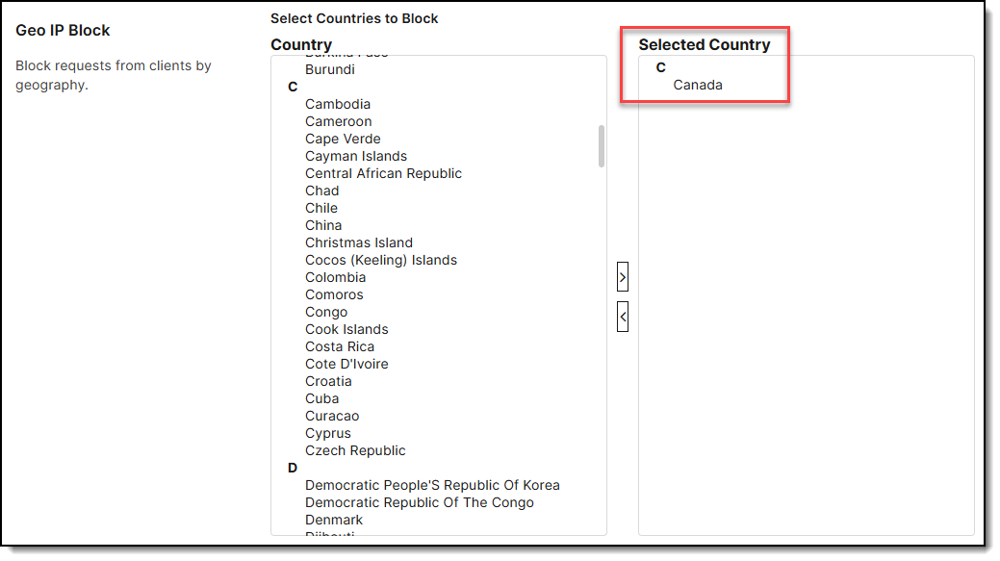

    ⚠️ Click `SAVE`

    ### Testing Geo IP

    Browse to <a href="https://@APP_NAME/login.php" target="_blank">https://@APP_NAME/login.php</a>.

    You should be **blocked**.

    

    ### Attack Logs

    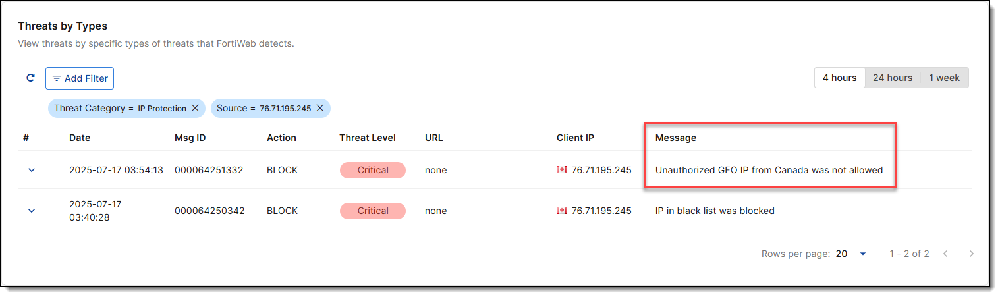

    !!! warning "Reminder"
        <center>**Remove Canada from the list and SAVE before proceeding with the rest of the lab.**</center>


??? note "Known Bots"
    ### Description

    Configuring Known Bots protects your websites, mobile applications, and APIs by blocking known malicious bots (e.g., DoS, Spam, Crawlers) while permitting activity from beneficial bots, such as search engines.

    ### Configuration

    Go to:  
    `WAF > Templates > StandardProtection-Clone > Bot Mitigation > Known Bots`

    Select **Crawler**.
    
    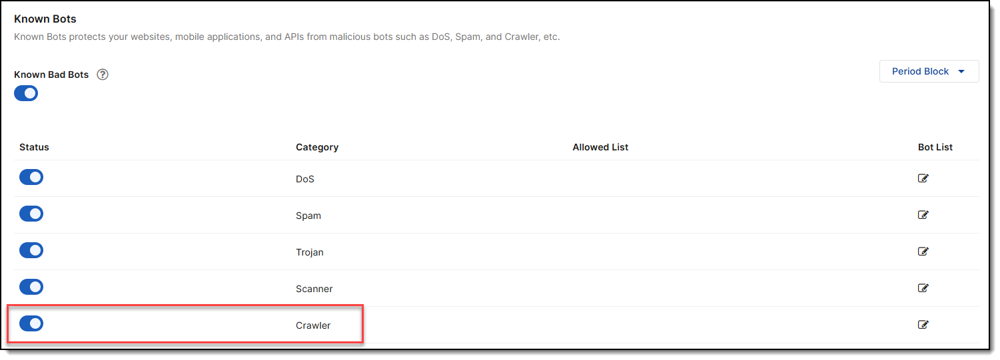

    ⚠️ Click `SAVE`

    ### Testing Known Bots

    Click the button below to simulate **Selenium with Chrome in Headless mode**:

    [Send request](#){ .md-button onclick="sendRequestWithHeadlessUserAgent()" }

    <div id="bot-result" style="margin-top: 1em; font-weight: bold;"></div>


??? note "DoS Protection Policy"
    ## DoS Protection Policy

    You can protect your web assets from a wide variety of denial of service (DoS) attacks.

    DoS features are organized by which open system interconnections (OSI) model layer they use primarily to apply the rate limit:

    - Application layer (HTTP or HTTPS)
    - Network and transport layer (TCP/IP)

    ### Configuration

    `DoS Protection > DoS Protection Policy`

    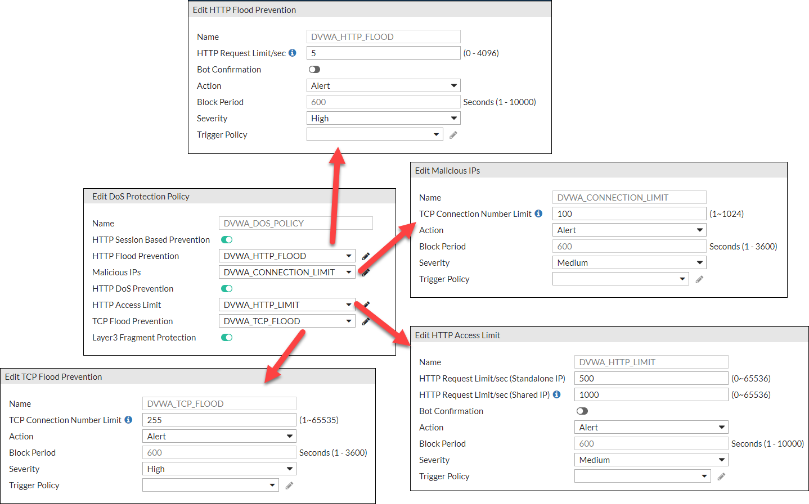

    ### Testing DoS HTTP Flood

    For this test, HTTP request limit / sec is set very low (5 instead of default 500).

    Go to any page and refresh very quickly with F5. Alternatively, hold down SHIFT button and click the Reload button several times.

    Go to Attack Logs.

    ### Attack Logs

    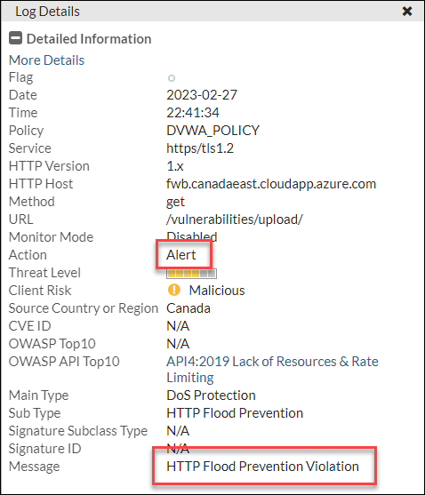


??? example "Custom Policy"
    ## Custom Policy

    Custom rules provide a degree of flexibility for complex conditions. You can combine any or all of these criteria:

    

    ### Configuration

    Example #1 – Detecting Vulnerability Scanning

    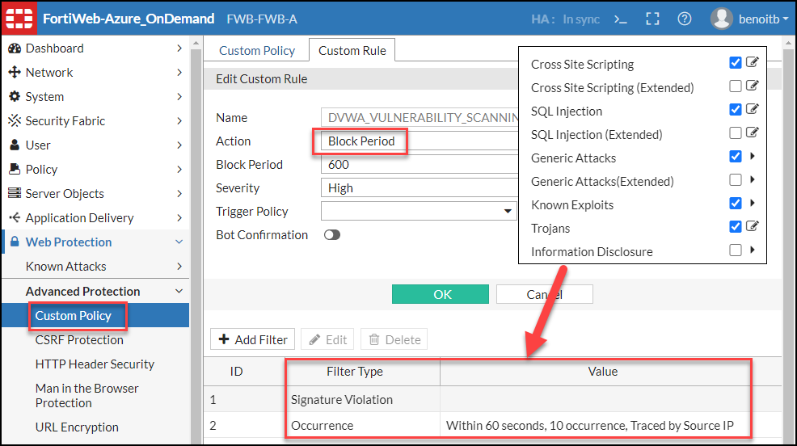

    Example #2 – Detecting Brute Force Login

    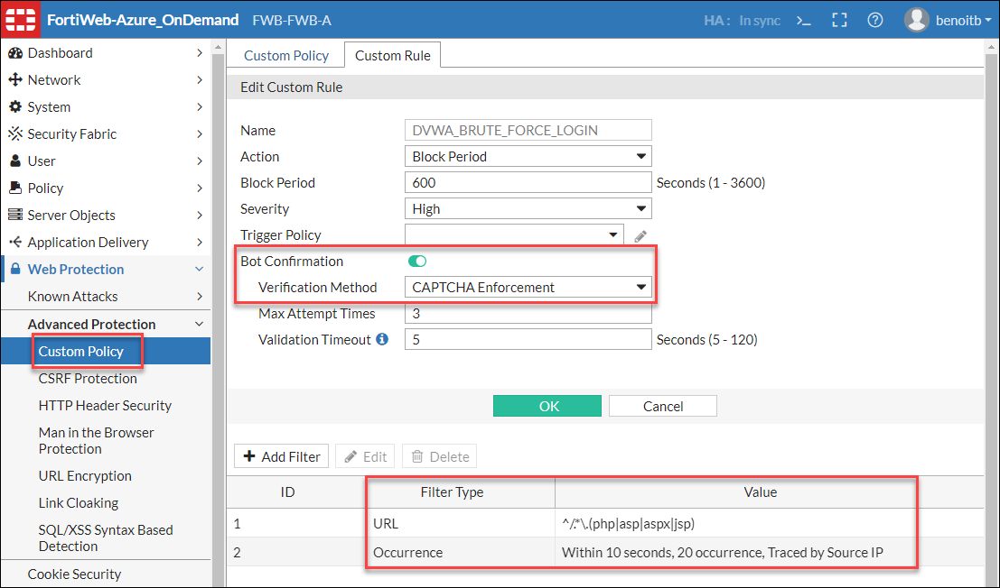

    ### Testing Vulnerability Scanning

    Browse to <a href="https://@APP_NAME/vulnerabilities/sqli/" target="_blank">https://@APP_NAME/vulnerabilities/sqli/</a> and submit `‘or 1=1#` 11 times.

    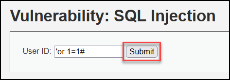

    FortiAppSec Cloud blocks SQL injection for the first 10 requests and quarantine the IP at the 11<sup>th</sup> request.

    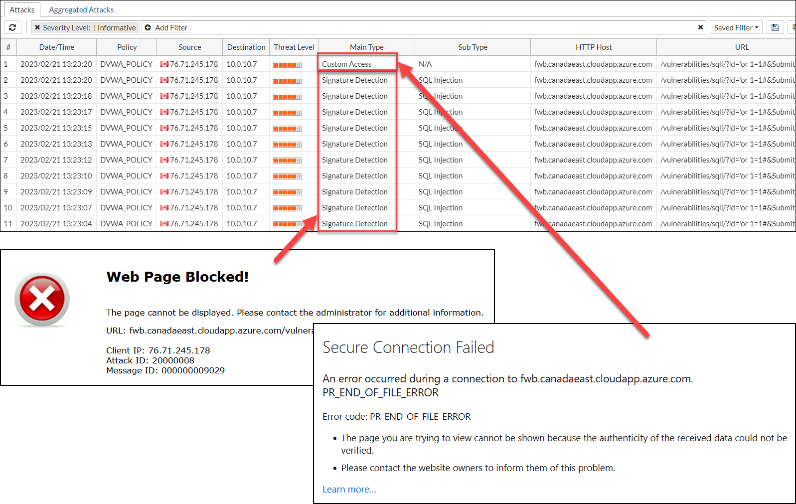

    Check the blocked IPs and release it for the next test.

    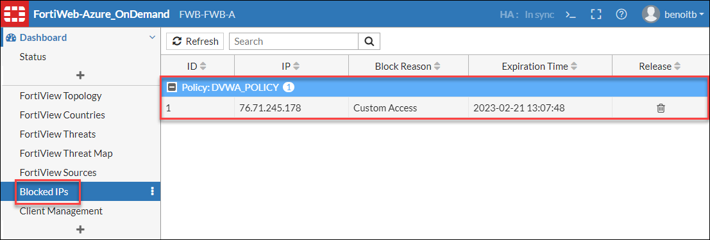


    ### Testing brute force attack

    Try to login 20 times very quickly with user “p” and no password. You can also reduce the configuration to 3 occurrences for testing purpose. **Don’t forget to configure it back to 20 after your test.**

    After few requests, FortiAppSec Cloud enforces a CAPTCHA to check if this is a bot or not. You can put a wrong answer to simulate a bot activity.

    

    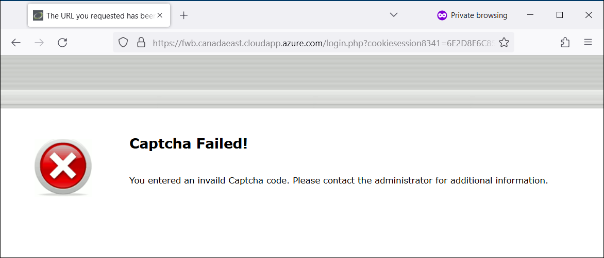

    Check the blocked IPs and release it for the next test.

    

    ### Attack Logs

    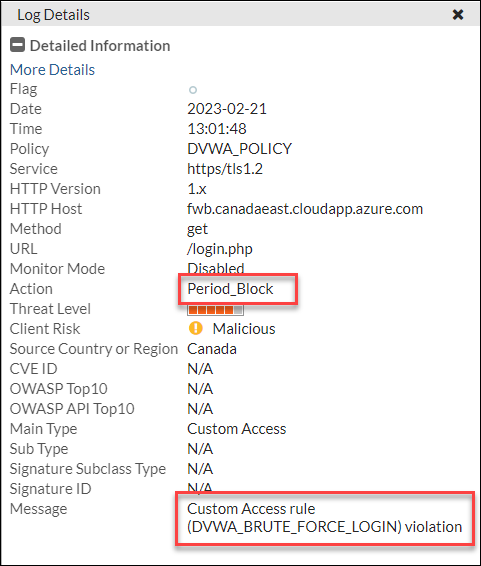


