To begin, we will connect to the DVWA Web Application through FortiAppSec Cloud.

??? note "Connecting to DVWA"
    ## Connecting to DVWA

    Connect to <a href="https://@APP_NAME" target="_blank">https://@APP_NAME</a>
    and authenticate with one of these accounts:

    | Username | Password |
    |:---------|:---------|
    | admin    | password |
    | gordonb  | abc123   |
    | 1337     | charley  |
    | pablo    | letmein  |
    | smithy   | password |

    ??? tip "Troubleshooting - If you encounter any authentication issues"

        - Browse to <a href="https://@APP_NAME/setup.php" target="_blank">https://@APP_NAME/setup.php</a>
    
        - Click on **Create / Reset Database**

        

This Hands-on Lab allows us to demonstrate 25+ FortiAppSec Cloud protections. Let's take a closer look at FortiAppSec Cloud's sequence of scans.

??? note "Sequence of Scans"
    ##Sequence of Scans

    FortiAppSec Cloud applies protection rules and performs protection profile scans in the order of execution according to the following list. The second tab ==highlights== the security features that will be demonstrated in this Hands-On Lab.

    === "Protections"

        1. TCP Connection Number Limit (TCP Flood Prevention)  
        2. Add X-Forwarded-For  
        3. IP List  
        4. IP Reputation  
        5. Known Bots  
        6. Geo IP  
        7. WebSocket security  
        8. HTTP Allow Method  
        9. HTTP Request Limit (HTTP Flood Prevention)  
        10. TCP Connection Number Limit (Malicious IP)  
        11. HTTP Request Limit (HTTP Access Limit)  
        12. URL Access  
        13. Mobile API Protection  
        14. Protocol Limits  
        15. File Protection  
        16. Advanced Bot Protection  
        17. Parameter Validation  
        18. Bot Deception  
        19. ML Based Bot Detection  
        20. Cross-site request forgery (CSRF) attacks  
        21. Protection for Man-in-the-Browser (MITB) attacks  
        22. Biometrics Based Detection  
        23. XML Protection  
        24. JSON Protection  
        25. Signature Based Detection  
        26. SQL Syntax Based Detection  
        27. Custom Rule  
        28. Threshold Based Detection  
        29. Account Takeover  
        30. API Gateway  
        31. OpenAPI Validation  
        32. URL Rewriting (rewriting & redirection)  
        33. Machine Learning - Anomaly Detection  
        34. Compression  
        35. Cookie Security


    === "Highlights"

        1. TCP Connection Number Limit (TCP Flood Prevention)  
        2. ==Add X-Forwarded-For==  
        3. ==IP List== 
        4. IP Reputation  
        5. Known Bots  
        6. ==Geo IP==  
        7. WebSocket security  
        8. ==HTTP Allow Method==  
        9. ==HTTP Request Limit (HTTP Flood Prevention)==  
        10. TCP Connection Number Limit (Malicious IP)  
        11. HTTP Request Limit (HTTP Access Limit)  
        12. ==URL Access==  
        13. Mobile API Protection  
        14. ==Protocol Limits==  
        15. ==File Protection==  
        16. Advanced Bot Protection  
        17. ==Parameter Validation==  
        18. ==Bot Deception==  
        19. ML Based Bot Detection
        20. ==Cross-site request forgery (CSRF) attacks==  
        21. ==Protection for Man-in-the-Browser (MITB) attacks==  
        22. Biometrics Based Detection  
        23. XML Protection  
        24. JSON Protection  
        25. ==Signature Based Detection==  
        26. SQL Syntax Based Detection  
        27. ==Custom Rule==  
        28. Threshold Based Detection  
        29. ==Account Takeover==  
        30. API Gateway  
        31. OpenAPI Validation  
        32. ==URL Rewriting (rewriting & redirection)==  
        33. ==Machine Learning - Anomaly Detection==  
        34. Compression  
        35. ==Cookie Security==

The template **StandardProtection-Clone** is already applied to the application.

This template includes several **pre-configured protection rules** that provide a strong baseline of security for your web application. It ensures protection against multiple types of threats without any manual configuration.

The following protections are already enabled:

- **Known Attacks**
- **File Protection**
- **Request Limits**
- **IP Protection**
- **Known Bots**
- **Threshold Based Detection**
- **DDOS Prevention**
- **Custom Rule**

Let's **review each of them**.

??? note "Known Attacks"
    ### Description
    FortiAppSec Cloud uses up-to-date **signatures** to block OWASP Top 10 threats like **XSS**, **SQL Injection**, and **known exploits**. It analyzes traffic at the **packet level**, checks against its signature database, and applies **automated actions** to protect your applications.

    ### Configuration

    Go to:  
    `WAF > Templates > StandardProtection-Clone > Security Rules > Known Attacks`

    Here are the key settings available in this section:

    **1. Actions**  
    You can choose how FortiAppSec reacts to known attacks: **Alert** logs the request, **Alert & Deny** blocks and logs, and **Deny (No Log)** blocks silently.

    **2. Sensitivity Level (SL)**  
    SL controls detection strictness from **SL1 (least strict)** to **SL4 (most strict)**. Higher levels improve protection but may block legitimate requests.

    **3. Mode Per Protection**  
    Each rule can be set to **Standard**, **Extended**, or **Disabled**. Extended offers broader coverage but may cause false positives.

    **4. Exception Rules**  
    Exception Rules skip inspection for specific URLs or parameters to prevent blocking known false positives.

    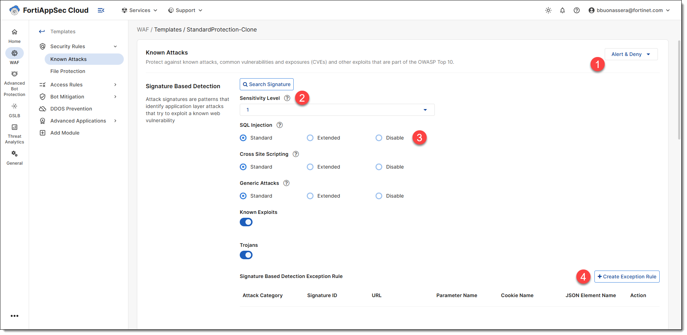

    ### Performing Command Injection

    Browse to <a href="https://@APP_NAME/vulnerabilities/exec/" target="_blank">https://@APP_NAME/vulnerabilities/exec/</a> and try one of these command injection attacks:

    ```
    ;ls -la
    ```
    ```
    ;more /etc/passwd
    ```

    

    Command injection will be **blocked**.

    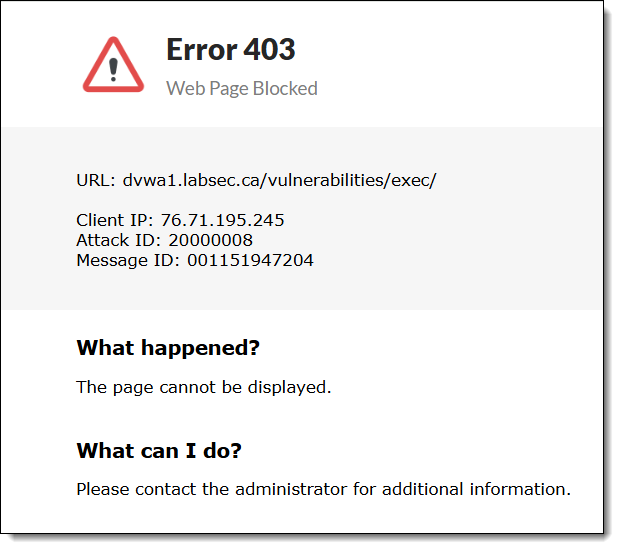

    Now try the following request:

    ```
    ;ps -aux
    ```

    This command is **not blocked** yet.

    Increase the sensitivity level to `3`.

    

    ⚠️ Click `SAVE` to apply the changes.

    Try the same request again:

    ```
    ;ps -aux
    ```

    Now it **should be blocked**. Let's see **why**.

    ### Attack Logs

    Go to:  
    `WAF > Applications > DVWA-Lab > FortiView > Threats by Types`

    Select `Known Attacks`.  

    Select the **Source IP**.  

    Select the **Log Entry**.

    Look at the **details in the log entry**.

    You will see the **Signature ID** and the **Matched Pattern** that triggered the protection.

    This helps you understand why the request was blocked and which rule was applied.

    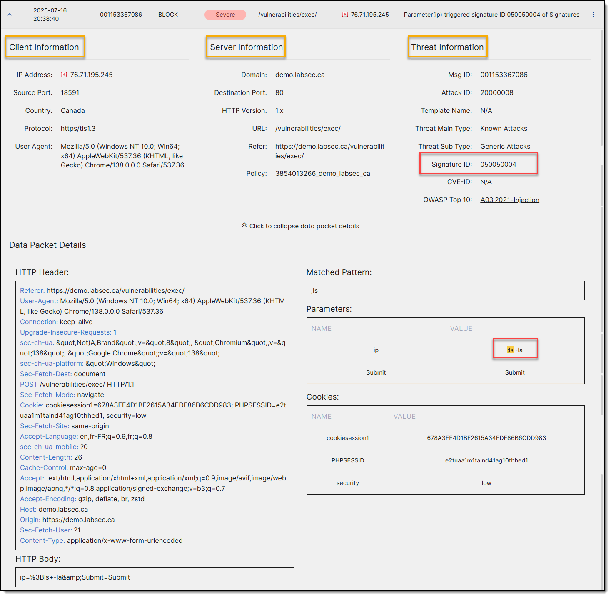

    Now check the log entry for the `ps -aux` command.

    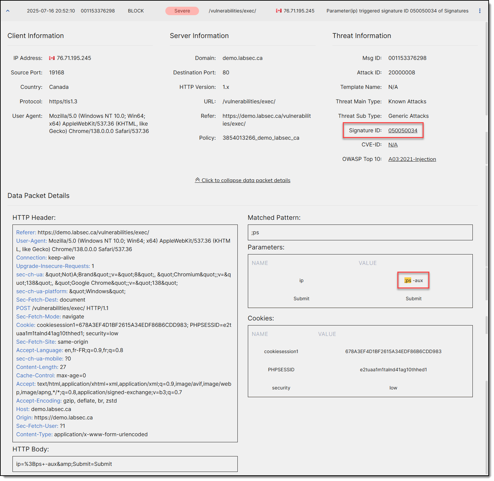

    Click on **Signature ID**.

    

    Go to:  
    `WAF > Templates > StandardProtection-Clone > Security Rules > Known Attacks`

    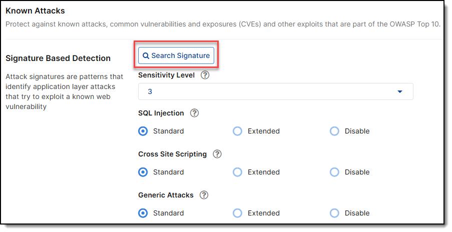

    Search for Signature ID:
    ```
    050050034
    ```

    This signature is set to sensitivity level **3**. That's why it was blocked the second time.

    

    You can also search for all signatures with sensitivity level 3.

    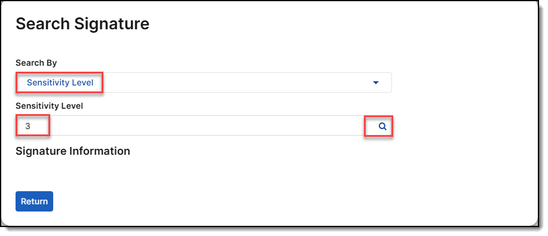

    ### Adding an Exception Rule

    Go to:  
    `WAF > Templates > StandardProtection-Clone > Security Rules > Known Attacks`

    Click `Create Exception Rule`

    Request URL:  
    ```
    /vulnerabilities/exec/
    ```
    Attack Category:
    ```
    Generic Attack
    ```
    Signature ID:  
    ```
    050050034
    ```

    

    Click `OK`

    ⚠️ Click `SAVE`
    
    Browse to <a href="https://@APP_NAME/vulnerabilities/exec/" target="_blank">https://@APP_NAME/vulnerabilities/exec/</a> and try this command injection:
    ```
    ;ps -aux
    ```
    The exception works (you may need to wait 1–2 minutes since the policy change does not apply immediately).

    Browse to <a href="https://@APP_NAME/vulnerabilities/sqli/" target="_blank">https://@APP_NAME/vulnerabilities/sqli/</a> and try the same command:
    ```
    ;ps -aux
    ```
    The exception **does not apply** to this URL. The signature is still enforced for the rest of the website.

    ### Signature Updates

    To check the latest signature updates, visit the **FortiGuard Labs** page:  
    [https://www.fortiguard.com/services/ws](https://www.fortiguard.com/services/ws){target="_blank"}

    For example, on **July 15**, **6 new signatures** were added to the database.

    


??? note "Machine Learning"
    ## Machine Learning

    The anomaly detection model of machine learning feature observes the URLs, parameters, and HTTP Method of HTTP and/or HTTPS sessions passing to your web servers. It builds mathematical models to detect abnormal traffic.

    ### Configuring Machine Learning

    browse to `Policy > Server Policy`, open `DVWA_POLICY`, go at the bottom page, and create your Machine Learning policy.

    

    Enter the domain name of your application. We will be using a **wildcard** domain. Click OK.

    ```
    *.cloudapp.azure.com
    ```

    

    Get the [Machine Learning Model File](download/machine-learning-model.dat) and import it.

    

    Browse to `Web Protection > ML Based Anomaly Detection`, open the policy, and click on the **domain**.

    

    Click on the **Parameter View** tab and select the **ip** parameter.

    

    The **Parameter View** provides statistics associated with various parameters, including HMM learning stages, boxplots, and the distribution of anomalies. It also allows you to rebuild parameters or adjust the strictness level for anomaly detection.

    The **diagram** illustrates the Distribution of Anomalies. The system determines the legitimacy of a request based on its probability score and the length of the parameter value.

    Click on **Test Sample**.

    | These are few samples you can test | Samples                   | Examine the Probability Score and Detection Result                 |
    |:---------------------------------- |:--------------------------|:-------------------------------------------------------------------|
    | A real IP                          |`1.1.1.1`                  |  |
    | A typo                             |`1.1.1..1`                 |  |
    | Another typo                       |`1.1.1.1&`                 |  |
    | An email address                   |`abc@real.com`             |  |
    | SQL Injection                      |`'OR 1=1#`                 |  |
    | Zero Day                           |`A 'DIV' B - A 'DIV B`     |  |

    ??? question "Why FortiAppSec Cloud employs two layers of machine learning?"
        FortiAppSec Cloud employs a dual-layer machine learning approach to identify malicious attacks. The first layer utilizes the <a href="https://en.wikipedia.org/wiki/Hidden_Markov_model" target="_blank">Hidden Markov Model (HMM)</a> to monitor application access and collect data, which is used to build a mathematical model for each parameter and HTTP method. Once this model is established, FortiAppSec Cloud assesses each incoming request against it to determine whether it is anomalous.

        If the first machine learning layer flags a request as anomalous, FortiAppSec Cloud engages its second layer to further scrutinize whether it constitutes a genuine attack or is merely a benign anomaly that can be disregarded. To accomplish this, FortiAppSec Cloud incorporates pre-trained threat models that utilize <a href="https://en.wikipedia.org/wiki/Support_vector_machine" target="_blank">Support Vector Machine (SVM)</a> technology, each representing a specific type of attack, such as SQL Injection or Cross-site Scripting. These models have been trained using data from thousands of attack samples and are consistently updated by the FortiAppSec Cloud Security Service. When new types of attacks emerge, the FortiGuard team analyzes them and updates the relevant threat models. These updated models are then distributed to all customer installations, similar to how signature updates are carried out.

        


    ### Testing Machine Learning
    
    Browse to <a href="https://@APP_NAME/vulnerabilities/exec/" target="_blank">https://@APP_NAME/vulnerabilities/exec/</a> and perform those 2 SQL Injections.

    ```
    'OR 1=1#
    ```
    ```
    A 'DIV' B - A 'DIV B
    ```
    
    

    ### Attack Logs

    The first pattern is detected by **Signatures** **Detection** and the second one by **Machine Learning**.

    

    

    ??? question "Why is the first attack blocked by signature-based protection, while the second is blocked through machine learning?""
        FortiAppSec Cloud applies protection rules and performs profile scans in a specific order of execution as documented in <a href="https://docs.fortinet.com/document/FortiAppSec Cloud/7.4.0/administration-guide/234292/sequence-of-scans" target="_blank">FortiAppSec Cloud 7.4.0 Administration Guide - Sequence of Scans</a>. If an HTTP request matches a known signature, it will be blocked immediately without ever reaching the machine learning engine. On the other hand, for zero-day attacks where no signature is effective, the machine learning engine takes over to detect and block the attack.


??? note "X-Forwarded-For"
    ## X-Forwarded-For

    In some topologies, you must configure FortiAppSec Cloud to add X-headers such as:

    - X-Forwarded-For
    - X-Real-IP
    - True-Client-IP

    The X-Forwarded-For (XFF) HTTP header field is a common method for identifying the originating IP address of a client connecting to a web server through an HTTP proxy or load balancer.

    ### Configuration

    Server Objects > X-Forwarded-For

    

    ### Checking HTTP header information’s

    Browse to <a href="https://@APP_NAME/phpinfo.php" target="_blank">https://@APP_NAME/phpinfo.php</a> and check if you can see your client public IP.

    


??? note "CSRF Protection"
    ## CSRF Protection

    Cross-Site Request Forgery (CSRF) is a type of security vulnerability that dupes a web browser into executing an undesired action within an authenticated application.

    The attack usually involves deceptive social engineering tactics, such as sending a misleading email or link to the victim. Because the user is already authenticated within the application when the attack occurs, it becomes challenging to differentiate between legitimate and fraudulent requests.

    ### Configuration

    `Web Protection > Advanced Protection > CSRF Protection`

    

    ### Preventing cross-site request forgery

    Browse to <a href="https://@APP_NAME/vulnerabilities/csrf/" target="_blank">https://@APP_NAME/vulnerabilities/csrf/</a> and change the admin password.

    You should see a token (**tknfv**) in the URL that has been added by FortiAppSec Cloud, meaning that the request is protected and allowed.

    

    You can **log out** and then **log in** again with your **new password**.

    Make sure you are authenticated to DVWA and browse to this <a href="/csrf-demo-page.html" target="_blank">demo page</a> to generate the attack.

    The aforementioned page employs Cross-Site Request Forgery to exploit your authenticated session in order to initiate a password change.

    

    Right-click and choose **Inspect** on the web page to reveal the hidden link.

    You can **log out** and then **log in** again: your password has not been changed.
    
    ### Attack Logs

    The password change has been blocked by FortiAppSec Cloud.

    

    ??? tip "Reseting the database for the next Labs"
        - Browse to <a href="https://@APP_NAME/setup.php" target="_blank">https://@APP_NAME/setup.php</a>
        - Click on **Create / Reset Database**
        - You can now login with the original password

        


??? note "File Security"
    ## File Security

    You can configure FortiAppSec Cloud to perform the following tasks:

    - Restrict file uploads based upon file type and size
    - Scan uploaded files for viruses
    - Submit uploaded files to FortiSandbox or FortiNDR

    ### Configuration

    `Web Protection > Input Validation > File Security`

    

    

    ### Testing file security

    Download <a href="https://secure.eicar.org/eicar_com.zip" target="_blank">https://secure.eicar.org/eicar_com.zip</a> on your computer.

    Browse to <a href="https://@APP_NAME/vulnerabilities/upload/" target="_blank">https://@APP_NAME/vulnerabilities/upload/</a> and upload **eicar_com.zip**.

    

    ### Attack Logs

    

??? note "Web Shell Detection"
    ## Web Shell Detection

    Attackers may attempt to upload Trojan horse code (written in scripting languages such as PHP and ASP) to the back-end web servers. The Trojan then infects clients who access an infected web page.

    ### Configuration

    `Web Protection > Input Validation > Web Shell Detection`

    

    ### Testing Web Shell detection

    First you need to **disable Antivirus Scan** as this may overlap Web Shell detection.

    Browse to `Web Protection > Input Validation > File Security`, open **DVWA_FILE_SECURITY_POLICY** and disable Antivirus Scan.

    

    Download a Webshell on Github: <a href="https://raw.githubusercontent.com/tennc/webshell/master/php/wso/wso.php" target="_blank">https://raw.githubusercontent.com/tennc/webshell/master/php/wso/wso.php</a>

    Browse to <a href="https://@APP_NAME/vulnerabilities/upload/" target="_blank">https://@APP_NAME/vulnerabilities/upload/</a> and upload wso.php.

    

    ### Attack Logs

    

??? note "Let’s Encrypt Certificates"
    ## Let’s Encrypt Certificates

    Let's Encrypt certificates are free and valid for 90 days, during which renewal can take place at any time. This is handled by an automated process designed to overcome manual creation, validation, signing, installation, and renewal of certificates for secure websites.

    ### Configuration

    `Server Objects > Certificates > Let's Encrypt`

    

    ### Generating a new Let’s Encrypt certificate

    Until now we have connected to the application with the default certificate.

    

    

    Let’s configure FortiAppSec Cloud to automatically obtain (and renew) a certificate from Let's encrypt.

    !!! tip ""
        For this lab, **we need to temporarily shutdown FWB-B**. It's crucial that the Primary member, FWB-A, which manages the configuration, is also the one handling the traffic. This is because the Let's Encrypt procedure relies on a challenge mechanism. If FWB-A sets up a challenge, but Let's Encrypt connects to FWB-B to verify it, the certificate generation will fail.

        You can turn FWB-B back on after completing this lab.

    Browse to `Server Objects > Certificates > Let's Encrypt` and check that the domain is correct.

    

    Browse to `Policy > Server Policy`, open **DVWA_POLICY**, choose **Let's Encrypt** option and select **DVWA_LE_CERTIFICATE**.

    

    Go back to `Server Objects > Certificates > Let's Encrypt` and click on **Issue** (1).
    
    Be patient and avoid clicking on **Issue** multiple times. Refresh the page to check for status updates. You can also view the **Event Logs** to monitor the progress of the process.

    After an average of 30 seconds, the **Status** (2) should be green.

    

    Close and open your browser.
    
    Browse to <a href="https://@APP_NAME" target="_blank">https://@APP_NAME</a>.
    
    Now you should have a valid certificate.

    

    ### Event Logs

    Check the Event Logs.

    

??? note "Allow Method"
    ## Allow Method

    You can configure policies that allow only specific HTTP request methods. This can be useful for preventing attacks, such as those exploiting the HTTP method TRACE.

    Many web applications only require GET and POST. Disabling all unused methods reduces the potential attack surface area for attackers.

    ### Configuration

    `Web Protection > Access > Allow Method`

    

    ### Testing Allow Method

    <span style="color:red;">This lab is only compatible with **Firefox**.</span>

    - Open **Firefox** and Browse to <a href="https://@APP_NAME" target="_blank">https://@APP_NAME</a>

    - Right-click anywhere on the page and select "**Inspect**" or press F12

    - Click on the **Network** tab (1).

    - **Reload** the page by pressing F5 or clicking the **reload icon** (2) in the toolbar.

    - Choose any request, right-click on it, and select **Edit and Resend** (3).

    - In the new panel on the left, there is a dropdown menu for selecting the **HTTP method** (4). Click the dropdown arrow and select **HEAD** as the HTTP method you want to use for this request.

    - Click the **Send** button (5) to resend the request with the modified HTTP method.

    

    ### Attack logs

    

??? note "Bot Mitigation Policy"
    ## Bot Mitigation Policy

    To quickly protect websites, mobile apps and APIs from automated threats, you can configure the bot mitigation feature to check more specific signatures such as client events, and occurrence of suspicious behaviors, etc. of regular clients.

    ### Configuration

    `Bot Mitigation > Bot Mitigation Policy`

    Bot Mitigation Policy protects from automated threats with different methods:

    

    | Detection Method          | Description   |
    |---------------------------|---------------|
    | **Bot Deception**             | Inserts invisible links in HTML responses to distinguish between regular clients and malicious bots like web crawlers. |
    | **Biometrics-based Detection** | Uses client events like mouse movement and keyboard activity to determine whether a request is coming from a human or a bot. |
    | **Threshold-based Detection**  | Sets rules based on occurrence, time period, and severity of suspicious behavior to assess whether a request is human or bot-generated. |
    | **Known Bots**                | Protects against malicious bots like DoS and spam, while allowing known good bots like search engines. |

    ### Testing Bot Deception

    Browse to <a href="https://@APP_NAME/login.php" target="_blank">https://@APP_NAME/login.php</a>, right click and select “View Page Source”.

    

    There’s a hidden link. Malicious bots like web crawler may request the link…

    Click on it or Browse to <a href="https://@APP_NAME/fake_url.php" target="_blank">https://@APP_NAME/fake_url.php</a>.

    

    ### Attack Logs

    

??? note "DoS Protection Policy"
    ## DoS Protection Policy

    You can protect your web assets from a wide variety of denial of service (DoS) attacks.

    DoS features are organized by which open system interconnections (OSI) model layer they use primarily to apply the rate limit:

    - Application layer (HTTP or HTTPS)
    - Network and transport layer (TCP/IP)

    ### Configuration

    `DoS Protection > DoS Protection Policy`

    

    ### Testing DoS HTTP Flood

    For this test, HTTP request limit / sec is set very low (5 instead of default 500).

    Go to any page and refresh very quickly with F5. Alternatively, hold down SHIFT button and click the Reload button several times.

    Go to Attack Logs.

    ### Attack Logs

    

??? note "URL Rewriting"
    ## URL Rewriting

    URL rewriting can prevent the disclosure of underlying technology or website structures to HTTP clients.

    Aside from security reasons, rewriting and redirects can be for aesthetic or business purposes, too.

    ### Configuration

    `Application Delivery > URL Rewriting`

    

    

    ### Testing URL Rewrite (301 Redirect)

    Browse to <a href="https://@APP_NAME/fortinet" target="_blank">https://@APP_NAME/fortinet</a>

    You will be redirected to **www.fortinet.com**.

    ### Testing URL Rewrite (Rewrite HTTP Header)

    Browse to <a href="https://@APP_NAME" target="_blank">https://@APP_NAME</a> and authenticate.

    Browse to <a href="https://@APP_NAME/change" target="_blank">https://@APP_NAME/change</a>.

    You will be redirected to /vulnerabilities/csrf/ page.

    

    ### Traffic logs

    

    

??? note "User Tracking"
    ## User Tracking

    The user tracking feature allows you to track sessions by user and capture a username for reference in traffic and attack log messages.

    ### Configuration

    `Tracking > User Tracking`

    

    ### Testing User Tracking

    Login to DVWA with any username...

    | Username | Password |
    |:---------|:---------|
    | admin    | password |
    | gordonb  | abc123   |
    | 1337     | charley  |
    | pablo    | letmein  |
    | smithy   | password |

    ...and perform any attack in the list:

    | URL                                                                                                                       | Attack pattern                                                      |
    |:--------------------------------------------------------------------------------------------------------------------------|---------------------------------------------------------------------|
    | <a href="https://@APP_NAME/vulnerabilities/exec/" target="_blank">/vulnerabilities/exec/</a>     | **`;ls`**                                                           |
    | <a href="https://@APP_NAME/vulnerabilities/sqli/" target="_blank">/vulnerabilities/sqli/</a>     | **`‘OR 1=1#`**                                                      |
    | <a href="/csrf-demo-page.html" target="_blank">CSRF</a>                                                                   | The page will exploit CSRF attack                                   |
    | <a href="https://@APP_NAME/vulnerabilities/upload/" target="_blank">/vulnerabilities/upload/</a> | Change the hidden field **MAX_FILE_SIZE** and reload the page (F5)  |
    | <a href="https://@APP_NAME/security.php" target="_blank">/security.php</a>                       | Change security cookie value to **medium** and reload the page (F5) |
    | <a href="https://@APP_NAME/vulnerabilities/upload/" target="_blank">/vulnerabilities/upload/</a> | Upload **eicar.zip**                                                |

    ### Attack Logs

    Browse to **Attack Logs** and right click a column heading to select the columns to display. Choose **Username** and **Apply**.

    

    The **Username** will be the last column, but you can move it to the left.

    

<span style="color:red;">The remaining labs are optional and can be explored if you have extra time.</span>

??? example "Custom Policy"
    ## Custom Policy

    Custom rules provide a degree of flexibility for complex conditions. You can combine any or all of these criteria:

    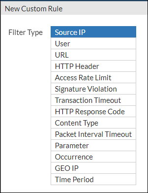

    ### Configuration

    Example #1 – Detecting Vulnerability Scanning

    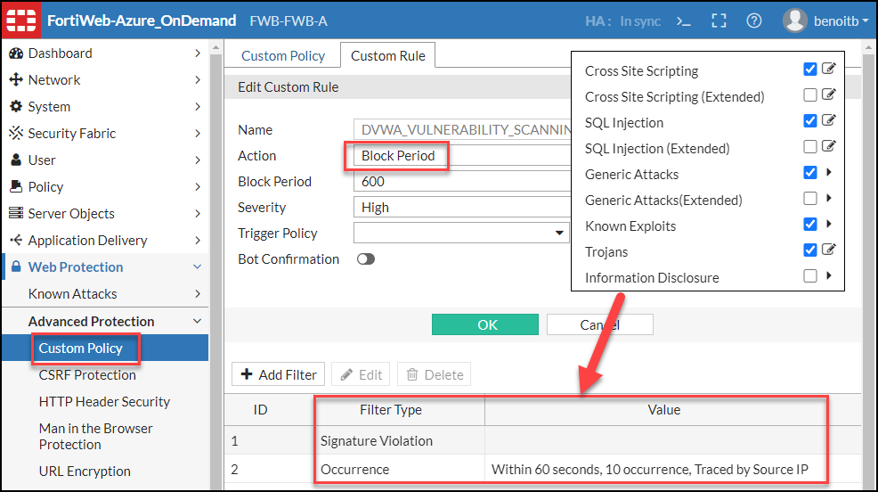

    Example #2 – Detecting Brute Force Login

    

    ### Testing Vulnerability Scanning

    Browse to <a href="https://@APP_NAME/vulnerabilities/sqli/" target="_blank">https://@APP_NAME/vulnerabilities/sqli/</a> and submit `‘or 1=1#` 11 times.

    

    FortiAppSec Cloud blocks SQL injection for the first 10 requests and quarantine the IP at the 11<sup>th</sup> request.

    

    Check the blocked IPs and release it for the next test.

    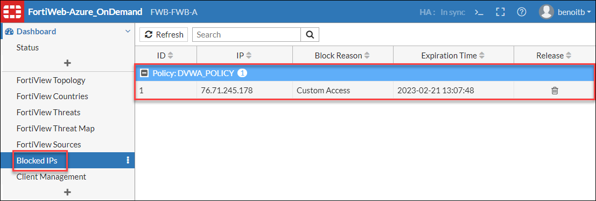


    ### Testing brute force attack

    Try to login 20 times very quickly with user “p” and no password. You can also reduce the configuration to 3 occurrences for testing purpose. **Don’t forget to configure it back to 20 after your test.**

    After few requests, FortiAppSec Cloud enforces a CAPTCHA to check if this is a bot or not. You can put a wrong answer to simulate a bot activity.

    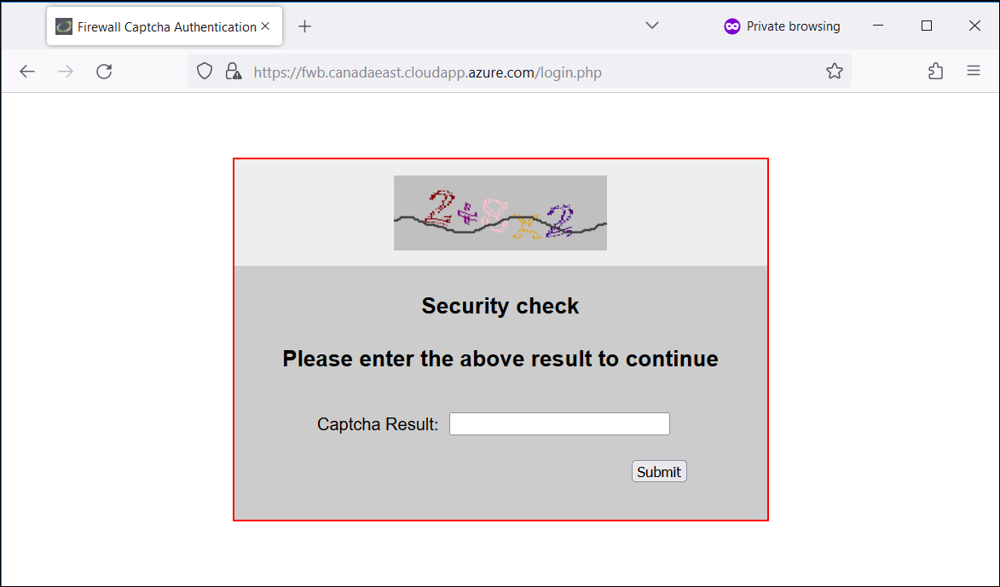

    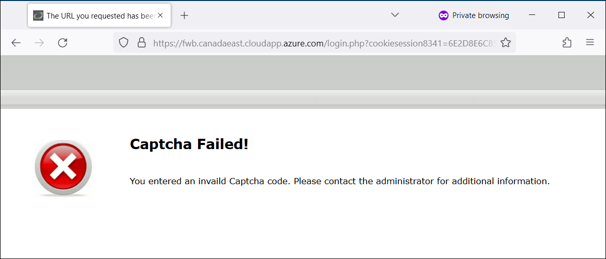

    Check the blocked IPs and release it for the next test.

    

    ### Attack Logs

    

??? example "HTTP Protocol Constraints"
    ## HTTP Protocol Constraints

    Protocol constraints govern features such as the HTTP header fields in the protocol itself, as well as the length of the HTML, XML, or other documents or encapsulated protocols carried in the HTTP body payload.

    Use protocol constraints to prevent attacks such as buffer overflows. Buffer overflows can occur in web servers and applications that do not restrict elements of the HTTP protocol to acceptable lengths, or that mishandle malformed requests. Such errors can lead to security vulnerabilities.

    ### Configuration

    `Web Protection > Protocol > HTTP`

    

    ### Performing duplicate name attack

    Browse to <a href="https://@APP_NAME/vulnerabilities/brute/?username=admin&username=admin&password=password&Login=Login#" target="_blank">https://@APP_NAME/vulnerabilities/brute/?username=admin&username=admin&password=password&Login=Login#</a>

    ### Attack Logs

    

??? example "HTTP Header Security"
    ## HTTP Header Security

    HTTP response security headers are a set of standard HTTP response headers proposed to prevent or mitigate known XSS, clickjacking, and MIME sniffing security vulnerabilities. These response headers define security policies to client browsers so that the browsers avoid exposure to known vulnerabilities when handling requests.

    When FortiAppSec Cloud's HTTP Security Headers feature is enabled, headers with specified values are inserted into HTTP responses coming from the backend web servers. This is a quick and simple solution to address the security vulnerabilities on your website without code and configuration changes. The following includes the security headers that FortiAppSec Cloud can insert into responses:

    ```py
    X-Frame-Options: DENY
    X-Frame-Options: SAMEORIGIN
    X-Frame-Options: ALLOW-FROM
    X-Content-Type-Options: nosniff
    X-XSS-Protection: 1
    X-XSS-Protection: 1; mode=block
    Content-Security-Policy: default-src 'self'
    Feature-Policy: microphone 'none'; geolocation 'none'
    Referrer-Policy: no-referrer
    Referrer-Policy: no-referrer-when-downgrade
    Referrer-Policy: same-origin
    Referrer-Policy: origin
    Referrer-Policy: strict-origin
    Referrer-Policy: origin-when-cross-origin
    Referrer-Policy: strict-origin-when-cross-origin
    Referrer-Policy: unsafe-url
    ```

    ### Configuration

    Web Protection > Advanced Protection > HTTP Header Security

    

    ### Testing HTTP Header Security

    Right click on the Web page, select **Inspect**, select **Network** tab, browse to <a href="https://@APP_NAME" target="_blank">https://@APP_NAME</a>, **reload** the page, select the first **entry**, search for **Response Header** and find the 3 **X-Headers**.

    

??? example "Parameter Validation"
    ## Parameter Validation

    You can configure rules to validate parameters (input) of your web applications.

    For example, one web page might have an HTML form with multiple inputs, including:

    - A username
    - A password
    - A preference for whether or not to remember the login

    Within the input rule for that web page, you can define separate rules for each parameter in the request: one rule for the **username** parameter, one rule for the **password** parameter, and one rule for the **preference** parameter. You can use the password rule to enforce password complexity by requiring it to match a **Level 2 Password** data type.

    ### Configuration

    `Web Protection > Input Validation > Parameter Validation`

    

    ### Testing parameter validation

    Browse to <a href="https://@APP_NAME/vulnerabilities/exec/" target="_blank">https://@APP_NAME/vulnerabilities/exec/</a>. In the **`Enter an IP address`** form enter a random string that is not an IP.

    You’re not blocked because the rule action is **Alert**.

    

    ### Attack Logs

    

??? example "Man in the Browser (MiTB) Protection"
    ## Man in the Browser (MiTB) Protection

    The Man-in-the-Browser (MiTB) attack uses Trojan Horse to intercept and manipulate calls between the browser and its security mechanisms or libraries on-the-fly. The Trojan Horse sniffs or modifies transactions as they are formed on the browser, but still displays back the user's intended transaction. The most common objective of this attack is to cause financial fraud by manipulating transactions of Internet Banking systems, even when other authentication factors are in use.

    To protect the user inputs from being attacked by MiTB, FortiAppSec Cloud implements security rules including obfuscation, encryption, anti-keylogger, and Ajax request allow list.

    ### Configuration

    `Web Protection > Advanced Protection > Man in the Browser Protection`

    

    ### Testing MitB

    Browse to <a href="https://@APP_NAME/vulnerabilities/brute/" target="_blank">https://@APP_NAME/vulnerabilities/brute/</a>

    Right click the page, select **Inspect**, go to **Inspector** tab (Firefox) or **Element** tab (Chrome, Edge) and find the username / password form.

    

    Now go to the web protection profile configuration.

    `Policy > Web Protection Profile > DVWA_PROTECTION_PROFILE`

    The “Man in the Browser Protection” setting should be empty. Select DVWA_PROTECTION_PROFILE and click OK.

    

    Refresh your browser. The form is now protected with MitB.

    

??? example "URL Access"
    ## URL Access

    URL access rules define which HTTP requests FortiAppSec Cloud accepts or denies based on:

    - Host name
    - URL
    - Origin of the request.

    ### Configuration

    Web Protection > Access > URL Access

    

    ### Testing URL Access

    Browse to [https://@APP_NAME/about.php](https://@APP_NAME/vulnerabilities/about.php)

    

    ### Attack Logs

    

??? example "HTTP Authentication"
    ## HTTP Authentication

    FortiAppSec Cloud can authenticate browsers before they are permitted to access a web page.

    ### Configuration

    `User > Local User`

    

    `User > User Group > User Group`

    

    `Application Delivery > Authentication`

    

    ### Testing authentication

    Browse to <a href="https://@APP_NAME/instructions.php" target="_blank">https://@APP_NAME/instructions.php</a>.

    Authenticate with username `demo`, password `demo`.

    

??? example "IP List"
    ## IP List

    You can define which source IP addresses are trusted clients, undetermined, or distrusted.

    ### Configuration

    `IP Protection > IP List`

    

    ### Testing IP List

    Browse to <a href="https://@APP_NAME/phpinfo.php" target="_blank">https://@APP_NAME/phpinfo.php</a>.

    Copy your **public IP** located in `HTTP Headers Information > X-Forwarded-For`

    

    On FortiAppSec Cloud, Browse to `IP Protection > IP List` and add your public IP in the Block IP List.

    

    Refresh your page on DVWA. You should be blocked.

    

    !!! warning "Warning"
        <center>**Remove your IP from the list!**</center>

    ### Attack Logs

    

??? example "FortiGate Quarantined IPs"
    ## FortiGate Quarantined IPs

    FortiGate can maintain a list of source IPs that it prevents from interacting with the network and protected systems. You can configure FortiAppSec Cloud to receive this list of IP addresses at intervals you specify. You can then configure an inline protection profile to detect the IP addresses in the list and take an appropriate action.

    ### Configuration

    `System > Config > FortiGate Integration`

    

    ### Testing FortiGate integration

    On FortiAppSec Cloud browse to `System > Config > FortiGate Integration` and change the admin credentials with yours.

    On FortiGate browse to `Dashboard > Quarantine Monitor` and manually add a **Ban IP**.

    

    

    On FortiAppSec Cloud browse to `Dashboard > Blocked IPs`. You should see the new IP received from FortiGate.

??? example "GEO IP"
    ## GEO IP

    While numerous websites have a global reach, some are region-specific. For instance, government web applications often cater exclusively to their own residents.

    ### Configuration

    `IP Protection > Geo IP`

    

    ### Testing Geo IP

    browse to `IP Protection > Geo IP` and add Canada as new Country to block.

    

    Now try to go on DVWA; you should be blocked.

    

    !!! warning "Warning"
        <center>**Remove Canada from the list!**</center>

    ### Attack Logs

    

??? example "Vulnerability Scanner"
    ## Vulnerability Scanner

    You can scan your web servers for known vulnerabilities, which helps you design protection profiles.

    ### Configuration

    Web Vulnerability Scan > Scan Profile

    

    ### Performing a scan

    Open a browser to DVWA, authenticate and copy the PHPSESSID cookie value.

    

    On FortiAppSec Cloud browse to `Web Vulnerability Scan > Scan Profile` and configure the Customer Headers as follow with your `PHPSESSID` value.

    ```py
    Cookie: security=low; PHPSESSID=evgihu3t04ht0tj5agcin4vec1
    ```

    

    Click OK.

    browse to `Web Vulnerability Scan > Web Vulnerability Scan Policy` and run the scan.

    

    Check the logs.

    

    browse to `Scan History`, select a line and click on Download.

    

    Download the XML report.

    

    browse to `Scanner Integration` and import the XML report.

    

    You can choose to mitigate a found vulnerability.

    
