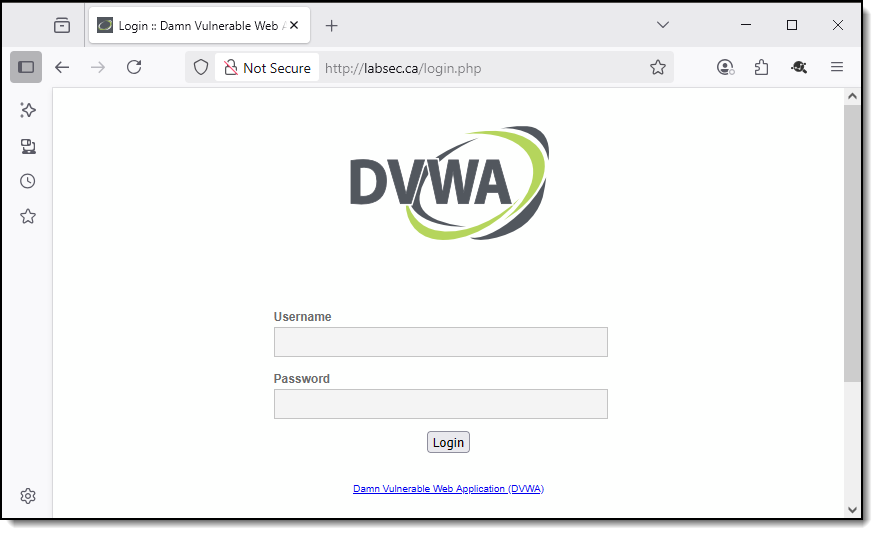

# Hands-On Lab: FortiAppSec Cloud

## Introduction

Welcome to this hands-on lab focused on **FortiAppSec Cloud**, Fortinet’s SaaS-based Web Application Firewall (WAF) and API protection platform.

In this lab, you will test FortiAppSec Cloud using the **Damn Vulnerable Web Application (DVWA)**, a deliberately insecure web application available at <a href="http://labsec.ca" target="_blank">http://labsec.ca</a>.

## Lab 1: Onboarding DVWA to FortiAppSec Cloud

In this hands-on lab, you will onboard the **Damn Vulnerable Web Application (DVWA)** to **FortiAppSec Cloud**. This step enables the WAF to inspect and protect inbound traffic against common web threats, including OWASP Top 10 vulnerabilities and zero-day exploits. Once onboarding is complete, all traffic to the DVWA instance will be routed through FortiAppSec Cloud, where it will be inspected and filtered before reaching the application.

You will also explore the main configuration options available during onboarding:

- **Endpoints**, which define the allowed protocols (HTTP/HTTPS), TLS versions, and cipher settings.
- **Origin Servers**, which specify where FortiAppSec Cloud forwards the traffic and how load balancing is handled.
- **Content Routing**, which enables routing based on elements like URL paths, headers, or IP addresses.

These settings allow you to tailor the traffic flow and security policies to fit your application architecture and risk profile.

## Lab 2: Protecting a Web Application with FortiAppSec Cloud

In this hands-on lab, you will learn how to secure a vulnerable web application (DVWA) using FortiWeb, Fortinet's Web Application Firewall. The lab environment is pre-configured and accessible via a public cloud instance.

You will explore more than 25 WAF features, including:

- **Signatures and Protocol Constraints**: Detect and block known attacks like SQL injection and command injection.
- **Machine Learning and Anomaly Detection**: Identify zero-day threats using dual-layer ML engines.
- **Bot Mitigation**: Block malicious bots based on behavior.
- **Cookie and CSRF Protection**: Prevent tampering with client-side data and forged requests.
- **URL Access, File Security, Web Shell Detection**: Enforce access control and prevent malicious uploads.
- **User Tracking and Logging**: Monitor attack logs, correlate events with users, and use FortiView for visibility.
- **Custom Policies and IP Reputation**: Create fine-grained rules and integrate IP blocklists.

Each section is modular and independent, so you can focus on the protections most relevant to your use case.
