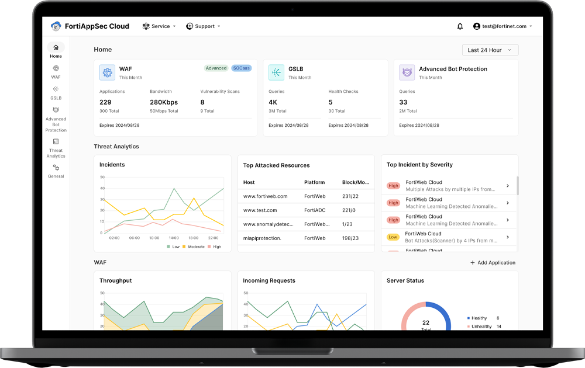

# 🧪 Hands-On Lab: FortiAppSec Cloud

## Introduction

Welcome to this hands-on lab focused on **FortiAppSec Cloud**, Fortinet’s SaaS-based Web Application Firewall (WAF) and API protection platform.

In this hands-on lab, you will go through all the steps to protect your application hosted at <a href="http://labsec.ca" target="_blank">http://labsec.ca</a>.

---

## Lab 1 – Exploring the FortiAppSec Cloud Portal

In this first lab, you will explore the **FortiAppSec Cloud** interface, understand how **licensing** works, and become familiar with key concepts related to **Web Application Firewall (WAF)** configuration.

---

## Lab 2 – Onboarding Your First Application

In this lab, you will onboard the **Damn Vulnerable Web Application (DVWA)** into **FortiAppSec Cloud**. Once onboarded, FortiAppSec Cloud will inspect all inbound traffic, providing protection against common threats including the **OWASP Top 10**. All traffic to DVWA will be encrypted and routed through FortiAppSec Cloud, where it will be filtered before reaching the application.

---

## Lab 3 – Exploring Standard Protections

In this lab, we will explore the **StandardProtection** WAF profile that secures DVWA. This profile activates key WAF modules, including protection against known attacks, malicious bots, IP-based threats, and abnormal traffic patterns. You will see how these protections are automatically enforced when interacting with the application, and how we can fine-tune them.
